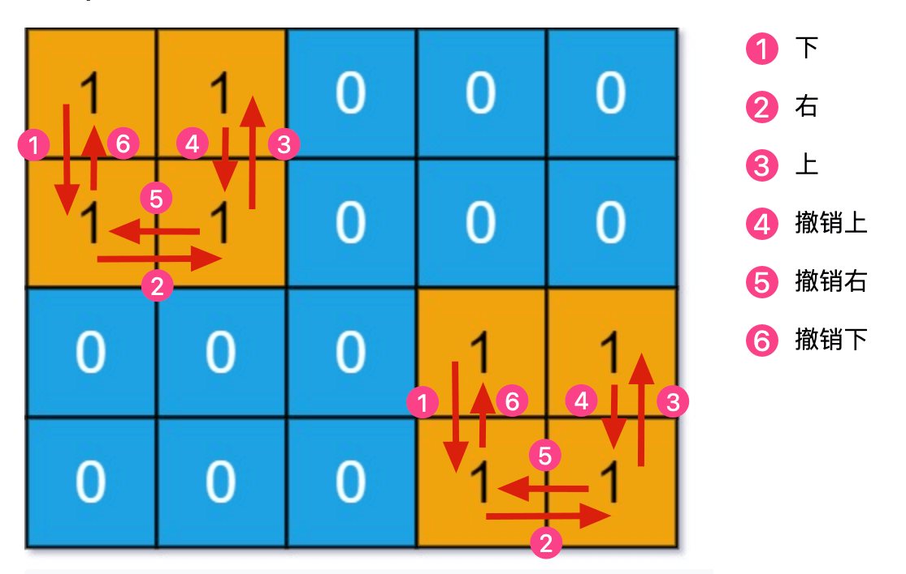

# 01 DFS（BFS）一文秒杀岛屿

|                             力扣                             | 难度 |
| :----------------------------------------------------------: | :--: |
| [200. 岛屿数量](https://leetcode-cn.com/problems/number-of-islands) |  🟠   |
| [1254. 统计封闭岛屿的数目](https://leetcode-cn.com/problems/number-of-closed-islands) |  🟠   |
| [1020. 飞地的数量](https://leetcode-cn.com/problems/number-of-enclaves) |  🟠   |
| [695. 岛屿的最大面积](https://leetcode-cn.com/problems/max-area-of-island) |  🟠   |
| [1905. 统计子岛屿](https://leetcode-cn.com/problems/count-sub-islands) |  🟠   |
| [694. 不同岛屿的数量](https://leetcode-cn.com/problems/number-of-distinct-islands)✨ |  🟠   |

岛屿系列算法问题是经典的面试高频题，虽然基本的问题并不难，但是这类问题有一些有意思的扩展，比如求子岛屿数量，求形状不同的岛屿数量等等，本文就来把这些问题一网打尽。

**岛屿系列题目的核心考点就是用 DFS（主要）算法遍历二维数组**。

那么如何在二维矩阵中使用 DFS 搜索呢？如果你把二维矩阵中的每一个位置看做一个节点，这个节点的上下左右四个位置就是相邻节点，那么整个矩阵就可以抽象成一幅网状的「图」结构。

```java
// 二维矩阵遍历框架
void dfs(int[][] grid, int i, int j, boolean[][] visited) {
    int m = grid.length, n = grid[0].length;
    if (i < 0 || j < 0 || i >= m || j >= n) {
        // 超出索引边界
        return;
    }
    if (visited[i][j]) {
        // 已遍历过 (i, j)
        return;
    }
    // 进入节点 (i, j)
    visited[i][j] = true;
    dfs(grid, i - 1, j, visited); // 上
    dfs(grid, i + 1, j, visited); // 下
    dfs(grid, i, j - 1, visited); // 左
    dfs(grid, i, j + 1, visited); // 右
}
```

> 这里额外说一个处理二维数组的常用小技巧，你有时会看到使用「方向数组」来处理上下左右的遍历，和前文 [图遍历框架](https://labuladong.github.io/algo/2/20/48/) 的代码很类似：可以按个人喜好来

```java
// 方向数组，分别代表上、下、左、右
int[][] dirs = new int[][]{{-1,0}, {1,0}, {0,-1}, {0,1}};

void dfs(int[][] grid, int i, int j, boolean[][] visited) {
    int m = grid.length, n = grid[0].length;
    if (i < 0 || j < 0 || i >= m || j >= n) {
        // 超出索引边界
        return;
    }
    if (visited[i][j]) {
        // 已遍历过 (i, j)
        return;
    }

    // 进入节点 (i, j)
    visited[i][j] = true;
    // 递归遍历上下左右的节点
    for (int[] d : dirs) {
        int next_i = i + d[0];
        int next_j = j + d[1];
        dfs(grid, next_i, next_j, visited);
    }
    // 离开节点 (i, j)
}
```

## 1. 岛屿数量

第 200 题「 [岛屿数量](https://leetcode-cn.com/problems/number-of-islands)」，最简单也是最经典的一道问题，题目会输入一个二维数组 `grid`，其中只包含 `0` 或者 `1`，`0` 代表海水，`1` 代表陆地，且假设该矩阵四周都是被海水包围着的。

我们说连成片的陆地形成岛屿，那么请你写一个算法，计算这个矩阵 `grid` 中岛屿的个。


例如上图，说题目给这个 `grid` 有四片岛屿，算法应该返回 4。

> **每次遇到岛屿，都要用 DFS 算法把岛屿「淹了」，避免维护 `visited` 数组**。
>
> 因为 `dfs` 函数遍历到值为 `0` 的位置会直接返回，所以只要把经过的位置都设置为 `0`，就可以起到不走回头路的作用。
>
> PS：这类 DFS 算法还有个别名叫做 [FloodFill 算法](https://mp.weixin.qq.com/s/Y7snQIraCC6PRhj9ZSnlzw)，现在有没有觉得 FloodFill 这个名字还挺贴切的~

```java
// 主函数，计算岛屿数量
int numIslands(char[][] grid) {
    int res = 0;
    int m = grid.length, n = grid[0].length;
    // 遍历 grid
    for (int i = 0; i < m; i++) {
        for (int j = 0; j < n; j++) {
            if (grid[i][j] == '1') {
                // 每发现一个岛屿，岛屿数量加一
                res++;
                // 然后使用 DFS 将岛屿淹了
                dfs(grid, i, j);
            }
        }
    }
    return res;
}

// 从 (i, j) 开始，将与之相邻的陆地都变成海水
void dfs(char[][] grid, int i, int j) {
    int m = grid.length, n = grid[0].length;
    if (i < 0 || j < 0 || i >= m || j >= n) {
        // 超出索引边界
        return;
    }
    if (grid[i][j] == '0') {
        // 已经是海水了
        return;
    }
    // 将 (i, j) 变成海水
    grid[i][j] = '0';
    // 淹没上下左右的陆地
    dfs(grid, i + 1, j);
    dfs(grid, i, j + 1);
    dfs(grid, i - 1, j);
    dfs(grid, i, j - 1);
}
```

> 只要提前把靠边的陆地都淹掉，然后算出来的就是封闭岛屿了。

力扣第 1020 题「 [飞地的数量](https://leetcode-cn.com/problems/number-of-enclaves)」，这题不让你求封闭岛屿的数量，而是求封闭岛屿的面积总和。

思路都是一样的，先把靠边的陆地淹掉，然后去数剩下的陆地数量就行了.

## 2. 岛屿的最大面积

这是力扣第 695 题「 [岛屿的最大面积](https://leetcode-cn.com/problems/max-area-of-island)」，`0` 表示海水，`1` 表示陆地，现在不让你计算岛屿的个数了，而是让你计算最大的那个岛屿的面积。

```java
int maxAreaOfIsland(int[][] grid) {
    // 记录岛屿的最大面积
    int res = 0;
    int m = grid.length, n = grid[0].length;
    for (int i = 0; i < m; i++) {
        for (int j = 0; j < n; j++) {
            if (grid[i][j] == 1) {
                // 淹没岛屿，并更新最大岛屿面积
                res = Math.max(res, dfs(grid, i, j));
            }
        }
    }
    return res;
}

// 淹没与 (i, j) 相邻的陆地，并返回淹没的陆地面积
int dfs(int[][] grid, int i, int j) {
    int m = grid.length, n = grid[0].length;
    if (i < 0 || j < 0 || i >= m || j >= n) {
        // 超出索引边界
        return 0;
    }
    if (grid[i][j] == 0) {
        // 已经是海水了
        return 0;
    }
    // 将 (i, j) 变成海水
    grid[i][j] = 0;

    return dfs(grid, i + 1, j)
         + dfs(grid, i, j + 1)
         + dfs(grid, i - 1, j)
         + dfs(grid, i, j - 1) + 1;
}
```

## 3. 子岛屿数量

力扣第 1905 题「 [统计子岛屿](https://leetcode-cn.com/problems/count-sub-islands)」


当岛屿 `B` 中所有陆地在岛屿 `A` 中也是陆地的时候，岛屿 `B` 是岛屿 `A` 的子岛。

**反过来说，如果岛屿 `B` 中存在一片陆地，在岛屿 `A` 的对应位置是海水，那么岛屿 `B` 就不是岛屿 `A` 的子岛**。

那么，我们只要遍历 `grid2` 中的所有岛屿，把那些不可能是子岛的岛屿排除掉，剩下的就是子岛。

```java
int countSubIslands(int[][] grid1, int[][] grid2) {
    int m = grid1.length, n = grid1[0].length;
    for (int i = 0; i < m; i++) {
        for (int j = 0; j < n; j++) {
            if (grid1[i][j] == 0 && grid2[i][j] == 1) {
                // 这个岛屿肯定不是子岛，淹掉
                dfs(grid2, i, j);
            }
        }
    }
    // 现在 grid2 中剩下的岛屿都是子岛，计算岛屿数量
    int res = 0;
    for (int i = 0; i < m; i++) {
        for (int j = 0; j < n; j++) {
            if (grid2[i][j] == 1) {
                res++;
                dfs(grid2, i, j);
            }
        }
    }
    return res;
}

// 从 (i, j) 开始，将与之相邻的陆地都变成海水
void dfs(int[][] grid, int i, int j) {
    int m = grid.length, n = grid[0].length;
    if (i < 0 || j < 0 || i >= m || j >= n) {
        return;
    }
    if (grid[i][j] == 0) {
        return;
    }

    grid[i][j] = 0;
    dfs(grid, i + 1, j);
    dfs(grid, i, j + 1);
    dfs(grid, i - 1, j);
    dfs(grid, i, j - 1);
}
```

> 这道题的思路和计算「封闭岛屿」数量的思路有些类似，只不过后者排除那些靠边的岛屿，前者排除那些不可能是子岛的岛屿。

## 4. 不同的岛屿数量

力扣第 694 题「 [不同的岛屿数量](https://leetcode-cn.com/problems/number-of-distinct-islands)」，题目还是输入一个二维矩阵，`0` 表示海水，`1` 表示陆地，这次让你计算 **不同的 (distinct)** 岛屿数量。


其中有四个岛屿，但是左下角和右上角的岛屿形状相同，所以不同的岛屿共有三个，算法返回 3。

**思路：**

很显然我们得想办法把二维矩阵中的「岛屿」进行转化，变成比如字符串这样的类型，然后利用 HashSet 这样的数据结构去重，最终得到不同的岛屿的个数。

如果想把岛屿转化成字符串，说白了就是序列化，序列化说白了就是遍历嘛，前文 [二叉树的序列化和反序列化](https://labuladong.github.io/algo/2/19/36/) 讲了二叉树和字符串互转，这里也是类似的。

**首先，对于形状相同的岛屿，如果从同一起点出发，`dfs` 函数遍历的顺序肯定是一样的**。

遍历顺序从某种意义上说就可以用来描述岛屿的形状，比如下图这两个岛屿：



假设它们的遍历顺序是：

> 下，右，上，撤销上，撤销右，撤销下

如果我用分别用 `1, 2, 3, 4` 代表上下左右，用 `-1, -2, -3, -4` 代表上下左右的撤销，那么可以这样表示它们的遍历顺序：

> 2, 4, 1, -1, -4, -2

**你看，这就相当于是岛屿序列化的结果，只要每次使用 `dfs` 遍历岛屿的时候生成这串数字进行比较，就可以计算到底有多少个不同的岛屿了**。

我们需要稍微改造 `dfs` 函数，添加一些函数参数以便记录遍历顺序：

```java
void dfs(int[][] grid, int i, int j, StringBuilder sb, int dir) {
    int m = grid.length, n = grid[0].length;
    if (i < 0 || j < 0 || i >= m || j >= n 
        || grid[i][j] == 0) {
        return;
    }
    // 前序遍历位置：进入 (i, j)
    grid[i][j] = 0;
    sb.append(dir).append(',');
    
    dfs(grid, i - 1, j, sb, 1); // 上
    dfs(grid, i + 1, j, sb, 2); // 下
    dfs(grid, i, j - 1, sb, 3); // 左
    dfs(grid, i, j + 1, sb, 4); // 右
    
    // 后序遍历位置：离开 (i, j)
    sb.append(-dir).append(',');
}
```

`dir` 记录方向，`dfs` 函数递归结束后，`sb` 记录着整个遍历顺序，其实这就是前文 [回溯算法核心套路](https://labuladong.github.io/algo/4/29/104/) 说到的回溯算法框架，你看到头来这些算法都是相通的。

有了这个 `dfs` 函数就好办了，我们可以直接写出最后的解法代码：

```java
int numDistinctIslands(int[][] grid) {
    int m = grid.length, n = grid[0].length;
    // 记录所有岛屿的序列化结果
    HashSet<String> islands = new HashSet<>();
    for (int i = 0; i < m; i++) {
        for (int j = 0; j < n; j++) {
            if (grid[i][j] == 1) {
                // 淹掉这个岛屿，同时存储岛屿的序列化结果
                StringBuilder sb = new StringBuilder();
                // 初始的方向可以随便写，不影响正确性
                dfs(grid, i, j, sb, 666);
                islands.add(sb.toString());
            }
        }
    }
    // 不相同的岛屿数量
    return islands.size();
}
```

## 5. 补充知识点

### 5.1 [HashSet]([Java HashSet | 菜鸟教程 (runoob.com)](https://www.runoob.com/java/java-hashset.html))

* HashSet 基于 HashMap 来实现的，是一个不允许有重复元素的集合。

* HashSet 允许有 null 值。

* HashSet 是无序的，即不会记录插入的顺序。

* HashSet 不是线程安全的， 如果多个线程尝试同时修改 HashSet，则最终结果是不确定的。 您必须在多线程访问时显式同步对 HashSet 的并发访问。

* HashSet 实现了 Set 接口。

```java
// 引入 HashSet 类      
import java.util.HashSet;

public class RunoobTest {
    public static void main(String[] args) {
        HashSet<String> sites = new HashSet<String>();
        sites.add("Google");
        sites.add("Runoob");
        sites.add("Taobao");
        sites.add("Zhihu");
        sites.add("Runoob");  // 重复的元素不会被添加
        System.out.println(sites);
      	
      	// 判断元素是否存在
        System.out.println(sites.contains("Taobao"));
        
        // 删除元素，删除成功返回 true，否则为 false
      	sites.remove("Taobao");  
      	
      	// 计算大小
      	System.out.println(sites.size());
      	
      	// 迭代 HashSet
      	for (String i : sites) {
            System.out.println(i);
        }
      	
      	// 清空元素
      	sites.clear();  
      
    }
}
```

执行以上代码，输出结果如下：

```
[Google, Runoob, Zhihu, Taobao]
true
3
Google
Runoob
Zhihu
```

### 5.2 [Java StringBuffer 和 StringBuilder 类]([Java StringBuffer 和 StringBuilder 类 | 菜鸟教程 (runoob.com)](https://www.runoob.com/java/java-stringbuffer.html))

当对字符串进行修改的时候，需要使用 StringBuffer 和 StringBuilder 类。

和 String 类不同的是，StringBuffer 和 StringBuilder 类的对象能够被多次的修改，并且不产生新的未使用对象。

在使用 StringBuffer 类时，每次都会对 StringBuffer 对象本身进行操作，而不是生成新的对象，所以如果需要对字符串进行修改推荐使用 StringBuffer。

StringBuilder 类在 Java 5 中被提出，它和 StringBuffer 之间的最大不同在于 StringBuilder 的方法不是线程安全的（不能同步访问）。

由于 StringBuilder 相较于 StringBuffer 有速度优势，所以多数情况下建议使用 StringBuilder 类。


> 然而在应用程序要求线程安全的情况下，则必须使用 StringBuffer 类。

**StringBuffer 方法**

以下是 StringBuffer 类支持的主要方法：

| 序号 | 方法描述                                                     |
| :--- | :----------------------------------------------------------- |
| 1    | public StringBuffer append(String s) 将指定的字符串追加到此字符序列。 |
| 2    | public StringBuffer reverse()  将此字符序列用其反转形式取代。 |
| 3    | public delete(int start, int end) 移除此序列的子字符串中的字符。 |
| 4    | public insert(int offset, int i) 将 `int` 参数的字符串表示形式插入此序列中。 |
| 5    | insert(int offset, String str) 将 `str` 参数的字符串插入此序列中。 |
| 6    | replace(int start, int end, String str) 使用给定 `String` 中的字符替换此序列的子字符串中的字符。 |

以下列表列出了 StringBuffer 类的其他常用方法：

| 序号 | 方法描述                                                     |
| :--- | :----------------------------------------------------------- |
| 1    | int capacity() 返回当前容量。                                |
| 2    | char charAt(int index) 返回此序列中指定索引处的 `char` 值。  |
| 3    | void ensureCapacity(int minimumCapacity) 确保容量至少等于指定的最小值。 |
| 4    | void getChars(int srcBegin, int srcEnd, char[] dst, int dstBegin) 将字符从此序列复制到目标字符数组 `dst`。 |
| 5    | int indexOf(String str) 返回第一次出现的指定子字符串在该字符串中的索引。 |
| 6    | int indexOf(String str, int fromIndex) 从指定的索引处开始，返回第一次出现的指定子字符串在该字符串中的索引。 |
| 7    | int lastIndexOf(String str) 返回最右边出现的指定子字符串在此字符串中的索引。 |
| 8    | int lastIndexOf(String str, int fromIndex) 返回 String 对象中子字符串最后出现的位置。 |
| 9    | int length()  返回长度（字符数）。                           |
| 10   | void setCharAt(int index, char ch) 将给定索引处的字符设置为 `ch`。 |
| 11   | void setLength(int newLength) 设置字符序列的长度。           |
| 12   | CharSequence subSequence(int start, int end) 返回一个新的字符序列，该字符序列是此序列的子序列。 |
| 13   | String substring(int start) 返回一个新的 `String`，它包含此字符序列当前所包含的字符子序列。 |
| 14   | String substring(int start, int end) 返回一个新的 `String`，它包含此序列当前所包含的字符子序列。 |
| 15   | String toString() 返回此序列中数据的字符串表示形式。         |

更多详细内容

- StringBuffer 类：https://www.runoob.com/manual/jdk11api/java.base/java/lang/StringBuffer.html
- StringBuilder 类：https://www.runoob.com/manual/jdk11api/java.base/java/lang/StringBuilder.html
