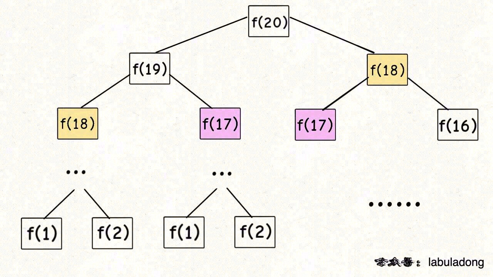
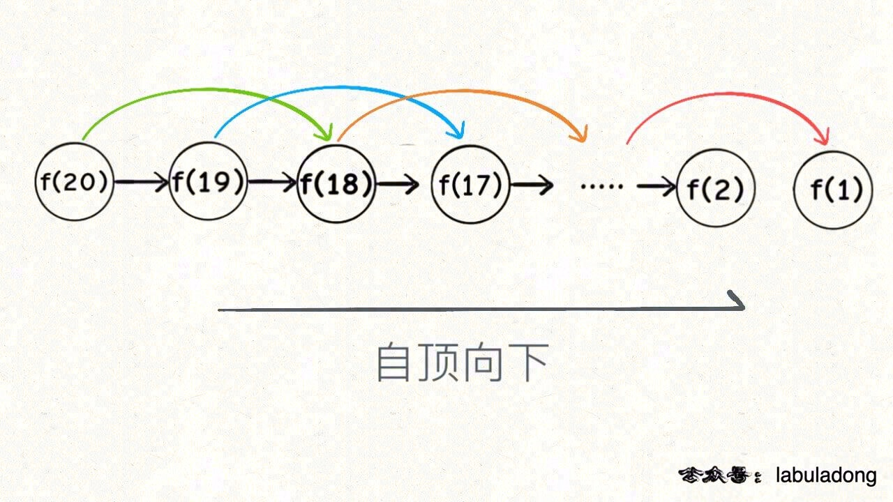
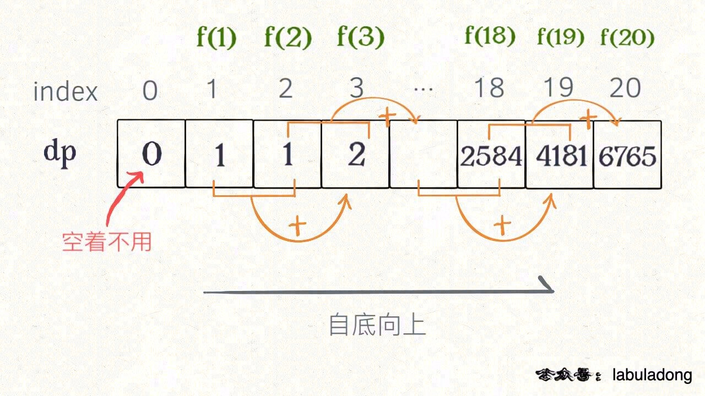
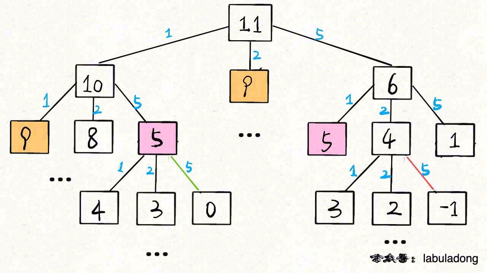

# 动态规划解题模版

|                            牛客网                            |                           LeetCode                           |                             力扣                             | 难度 |
| :----------------------------------------------------------: | :----------------------------------------------------------: | :----------------------------------------------------------: | :--: |
| [斐波那契数](https://www.nowcoder.com/practice/c6c7742f5ba7442aada113136ddea0c3?tpId=295&fromPut=pc_wzcpa_labuladong_sf) | [509. Fibonacci Number](https://leetcode.com/problems/fibonacci-number) | [509. 斐波那契数](https://leetcode-cn.com/problems/fibonacci-number) |  🟢   |
| [零钱兑换](https://www.nowcoder.com/practice/3911a20b3f8743058214ceaa099eeb45?https://www.nowcoder.com/practice/3911a20b3f8743058214ceaa099eeb45?tpId=295&fromPut=pc_wzcpa_labuladong_sf) | [322. Coin Change](https://leetcode.com/problems/coin-change) | [322. 零钱兑换](https://leetcode-cn.com/problems/coin-change) |  🟠   |

视频版： [动态规划框架套路详解](https://www.bilibili.com/video/BV1XV411Y7oE)

本文解决几个问题：

* 动态规划是什么？
* 解决动态规划问题有什么技巧？
* 如何学习动态规划？

**动态规划系列章节，都在使用本文的解题框架思维**，

**首先，动态规划问题的一般形式就是求最值**。比如：

* 求**最长**递增子序列
* **最小**编辑距离

既然是要求最值，核心问题是什么呢？

**求解动态规划的核心问题是穷举**。因为要求最值，肯定要把所有可行的答案穷举出来，然后在其中找最值呗。

动态规划三个要素：

* 动态规划的穷举有点特别，因为这类问题**存在「重叠子问题」**，如果暴力穷举的话效率会极其低下，所以需要「备忘录」或者「DP table」来优化穷举过程，避免不必要的计算。

* 动态规划问题一定会**具备「最优子结构」**，才能通过子问题的最值得到原问题的最值。

* 列出**正确的「状态转移方程」**，才能正确地穷举。

以上提到的重叠子问题、最优子结构、状态转移方程就是动态规划三要素。

但是在实际的算法问题中，**写出状态转移方程是最困难的**，一个思维框架，辅助你思考状态转移方程：

**明确 base case -> 明确「状态」-> 明确「选择」 -> 定义 dp 数组/函数的含义**。

按上面的套路走，最后的结果就可以套这个框架：

```python
# 初始化 base case
dp[0][0][...] = base
# 进行状态转移
for 状态1 in 状态1的所有取值：
    for 状态2 in 状态2的所有取值：
        for ...
            dp[状态1][状态2][...] = 求最值(选择1，选择2...)
```

下面通过斐波那契数列问题和凑零钱问题来详解动态规划的基本原理。前者主要是让你明白什么是重叠子问题（斐波那契数列没有求最值，所以严格来说不是动态规划问题），后者主要举集中于如何列出状态转移方程。

## 1. 斐波那契数列

力扣第 509 题「 [斐波那契数](https://leetcode-cn.com/problems/fibonacci-number)」。

**只有简单的例子才能让你把精力充分集中在算法背后的通用思想和技巧上，而不会被那些隐晦的细节问题搞的莫名其妙**。

### 1.1 暴力递归

斐波那契数列的数学形式就是递归的，写成代码就是这样：

```java
int fib(int N) {
    if (N == 1 || N == 2) return 1;
    return fib(N - 1) + fib(N - 2);
}
```



这个递归树怎么理解？

就是说想要计算原问题 `f(20)`，我就得先计算出子问题 `f(19)` 和 `f(18)`，然后要计算 `f(19)`，我就要先算出子问题 `f(18)` 和 `f(17)`，以此类推。最后遇到 `f(1)` 或者 `f(2)` 的时候，结果已知，就能直接返回结果，递归树不再向下生长了。

**递归算法的时间复杂度怎么计算？就是用子问题个数乘以解决一个子问题需要的时间**。

1. 首先计算子问题个数，即递归树中节点的总数。显然二叉树节点总数为指数级别，所以子问题个数为 O(2^n)。

2. 然后计算解决一个子问题的时间，在本算法中，没有循环，只有 `f(n - 1) + f(n - 2)` 一个加法操作，时间为 O(1)。

所以，这个算法的时间复杂度为二者相乘，即 O(2^n)，指数级别，爆炸。

观察递归树，很明显发现了算法低效的原因：

* 存在大量重复计算，比如 `f(18)` 被计算了两次，而且以 `f(18)` 为根的这个递归树体量巨大，不止 `f(18)` 这一个节点被重复计算，所以这个算法及其低效。

这就是动态规划问题的第一个性质：**重叠子问题**。

### 1.2 带备忘录的递归解法

一般使用一个数组充当这个「备忘录」，当然你也可以使用哈希表（字典），思想都是一样的。

```java
int fib(int N) {
    // 备忘录全初始化为 0
    int[] memo = new int[N + 1];
    // 进行带备忘录的递归
    return helper(memo, N);
}

int helper(int[] memo, int n) {
    // base case
    if (n == 0 || n == 1) return n;
    // 已经计算过，不用再计算了
    if (memo[n] != 0) return memo[n];
    memo[n] = helper(memo, n - 1) + helper(memo, n - 2);
    return memo[n];
}
```

备忘录的作用相当于给递归树进行剪枝。



由于本算法不存在冗余计算，子问题就是 `f(1)`, `f(2)`, `f(3)` … `f(20)`，数量和输入规模 n = 20 成正比，所以子问题个数为 O(n)。

解决一个子问题的时间，同上，没有什么循环，时间为 O(1)。

所以，本算法的时间复杂度是 O(n)，比起暴力算法，是降维打击。

至此，带备忘录的递归解法的效率已经和迭代的动态规划解法一样了。实际上，这种解法和常见的动态规划解法已经差不多了，只不过这种解法是「自顶向下」进行「递归」求解，我们更常见的动态规划代码是「自底向上」进行「递推」求解。

* 「自顶向下」：注意我们刚才画的递归树（或者说图），是从上向下延伸，都是从一个规模较大的原问题比如说 `f(20)`，向下逐渐分解规模，直到 `f(1)` 和 `f(2)` 这两个 base case，然后逐层返回答案，这就叫「自顶向下」。

* 「自底向上」：反过来，我们直接从最底下、最简单、问题规模最小、已知结果的 `f(1)` 和 `f(2)`（base case）开始往上推，直到推到我们想要的答案 `f(20)`。这就是「递推」的思路，这也是动态规划一般都脱离了递归，而是由循环迭代完成计算的原因。

### 1.3 `dp` 数组的迭代（递推）解法 

有了上一步「备忘录」的启发，我们可以把这个「备忘录」独立出来成为一张表，通常叫做 DP table，就可以在这张表上完成「自底向上」的推算。

```java
int fib(int N) {
    if (N == 0) return 0;
    int[] dp = new int[N + 1];
    // base case
    dp[0] = 0; dp[1] = 1;
    // 状态转移
    for (int i = 2; i <= N; i++) {
        dp[i] = dp[i - 1] + dp[i - 2];
    }

    return dp[N];
}
```



这个 DP table 特别像之前那个「剪枝」后的结果，只是反过来算而已。实际上，带备忘录的递归解法中的「备忘录」，最终完成后就是这个 DP table，所以说这两种解法其实是差不多的，大部分情况下，效率也基本相同。

这里，引出「状态转移方程」这个名词，实际上就是描述问题结构的数学形式：


「状态转移方程」是解决问题的核心，而且其实状态转移方程直接代表着暴力解法。

**千万不要看不起暴力解，动态规划问题最困难的就是写出这个暴力解，即状态转移方程**。

只要写出暴力解，优化方法无非是用备忘录或者 DP table，再无奥妙可言。

最后一个细节优化。

根据斐波那契数列的状态转移方程，当前状态只和之前的两个状态有关，其实并不需要那么长的一个 DP table 来存储所有的状态，只要想办法存储之前的两个状态就行了。

所以，可以进一步优化，把空间复杂度降为 O(1)。

```java
int fib(int n) {
    if (n == 0 || n == 1) {
        // base case
        return n;
    }
    // 分别代表 dp[i - 1] 和 dp[i - 2]
    int dp_i_1 = 1, dp_i_2 = 0;
    for (int i = 2; i <= n; i++) {
        // dp[i] = dp[i - 1] + dp[i - 2];
        int dp_i = dp_i_1 + dp_i_2;
        // 滚动更新
        dp_i_2 = dp_i_1;
        dp_i_1 = dp_i;
    }
    return dp_i_1;
}
```

> 这一般是动态规划问题的最后一步优化，如果我们发现每次状态转移只需要 DP table 中的一部分，那么可以尝试缩小 DP table 的大小，只记录必要的数据，从而降低空间复杂度。

## 2. 凑零钱问题

这是力扣第 322 题「 [零钱兑换](https://leetcode-cn.com/problems/coin-change)」：

给你 `k` 种面值的硬币，面值分别为 `c1, c2 ... ck`，每种硬币的数量无限，再给一个总金额 `amount`，问你**最少**需要几枚硬币凑出这个金额，如果不可能凑出，算法返回 -1 。

比如说 `k = 3`，面值分别为 1，2，5，总金额 `amount = 11`。那么最少需要 3 枚硬币凑出，即 11 = 5 + 5 + 1。

###  2.1 暴力递归

首先，这个问题是动态规划问题，因为它具有「最优子结构」的。**要符合「最优子结构」，子问题间必须互相独立**。

> 比如说，假设你考试，每门科目的成绩都是互相独立的。你的原问题是考出最高的总成绩，那么你的子问题就是要把语文考到最高，数学考到最高…… 为了每门课考到最高，你要把每门课相应的选择题分数拿到最高，填空题分数拿到最高…… 当然，最终就是你每门课都是满分，这就是最高的总成绩。
>
> 得到了正确的结果：最高的总成绩就是总分。因为这个过程符合最优子结构，“每门科目考到最高”这些子问题是互相独立，互不干扰的。
>
> 但是，如果加一个条件：你的语文成绩和数学成绩会互相制约，数学分数高，语文分数就会降低，反之亦然。这样的话，显然你能考到的最高总成绩就达不到总分了，按刚才那个思路就会得到错误的结果。因为子问题并不独立，语文数学成绩无法同时最优，所以最优子结构被破坏。

回到凑零钱问题，为什么说它符合最优子结构呢？

比如你想求 `amount = 11` 时的最少硬币数（原问题），如果你知道凑出 `amount = 10` 的最少硬币数（子问题），你只需要把子问题的答案加一（再选一枚面值为 1 的硬币）就是原问题的答案。因为硬币的数量是没有限制的，所以子问题之间没有相互制，是互相独立的。

那么，既然知道了这是个动态规划问题，就要思考**如何列出正确的状态转移方程**？

1. **确定 base case**，这个很简单，显然目标金额 `amount` 为 0 时算法返回 0，因为不需要任何硬币就已经凑出目标金额了。

2. **确定「状态」，也就是原问题和子问题中会变化的变量**。由于硬币数量无限，硬币的面额也是题目给定的，只有目标金额会不断地向 base case 靠近，所以唯一的「状态」就是目标金额 `amount`。

3. **确定「选择」，也就是导致「状态」产生变化的行为**。目标金额为什么变化呢，因为你在选择硬币，你每选择一枚硬币，就相当于减少了目标金额。所以说所有硬币的面值，就是你的「选择」。

4. **明确 `dp` 函数/数组的定义**。我们这里讲的是自顶向下的解法，所以会有一个递归的 `dp` 函数，一般来说函数的参数就是状态转移中会变化的量，也就是上面说到的「状态」；函数的返回值就是题目要求我们计算的量。就本题来说，状态只有一个，即「目标金额」，题目要求我们计算凑出目标金额所需的最少硬币数量。

**所以我们可以这样定义 `dp` 函数：`dp(n)` 表示，输入一个目标金额 `n`，返回凑出目标金额 `n` 所需的最少硬币数量**。

搞清楚上面这几个关键点，解法的伪码就可以写出来了：

```java
// 伪码框架
int coinChange(int[] coins, int amount) {
    // 题目要求的最终结果是 dp(amount)
    return dp(coins, amount)
}

// 定义：要凑出金额 n，至少要 dp(coins, n) 个硬币
int dp(int[] coins, int n) {
    // 做选择，选择需要硬币最少的那个结果
    for (int coin : coins) {
        res = min(res, 1 + dp(n - coin))
    }
    return res
}
```

根据伪码，我们加上 base case 即可得到最终的答案。显然目标金额为 0 时，所需硬币数量为 0；当目标金额小于 0 时，无解，返回 -1：

```java
int coinChange(int[] coins, int amount) {
    // 题目要求的最终结果是 dp(amount)
    return dp(coins, amount)
}

// 定义：要凑出金额 n，至少要 dp(coins, n) 个硬币
int dp(int[] coins, int amount) {
    // base case
    if (amount == 0) return 0;
    if (amount < 0) return -1;

    int res = Integer.MAX_VALUE;
    for (int coin : coins) {
        // 计算子问题的结果
        int subProblem = dp(coins, amount - coin);
        // 子问题无解则跳过
        if (subProblem == -1) continue;
        // 在子问题中选择最优解，然后加一
        res = Math.min(res, subProblem + 1);
    }

    return res == Integer.MAX_VALUE ? -1 : res;
```

至此，状态转移方程其实已经完成了，以上算法已经是暴力解法了，以上代码的数学形式就是状态转移方程：


### 2.2 带备忘录的递归

接下来需要消除一下重叠子问题，比如 `amount = 11, coins = {1,2,5}` 时画出递归树看看：



只需要稍加修改，就可以通过备忘录消除子问题：

```java
int[] memo;

int coinChange(int[] coins, int amount) {
    memo = new int[amount + 1];
    // 备忘录初始化为一个不会被取到的特殊值，代表还未被计算
    Arrays.fill(memo, -666);

    return dp(coins, amount);
}

int dp(int[] coins, int amount) {
    if (amount == 0) return 0;
    if (amount < 0) return -1;
    // 查备忘录，防止重复计算
    if (memo[amount] != -666)
        return memo[amount];

    int res = Integer.MAX_VALUE;
    for (int coin : coins) {
        // 计算子问题的结果
        int subProblem = dp(coins, amount - coin);
        // 子问题无解则跳过
        if (subProblem == -1) continue;
        // 在子问题中选择最优解，然后加一
        res = Math.min(res, subProblem + 1);
    }
    // 把计算结果存入备忘录
    memo[amount] = (res == Integer.MAX_VALUE) ? -1 : res;
    return memo[amount];
}
```

很显然「备忘录」大大减小了子问题数目，完全消除了子问题的冗余，所以子问题总数不会超过金额数 `n`，即子问题数目为 `O(n)`。处理一个子问题的时间不变，仍是 `O(k)`，所以总的时间复杂度是 `O(kn)`。

### 2.3 dp 数组的迭代解法

当然，我们也可以自底向上使用 dp table 来消除重叠子问题，关于「状态」「选择」和 base case 与之前没有区别，`dp` 数组的定义和刚才 `dp` 函数类似，也是把「状态」，也就是目标金额作为变量。不过 `dp` 函数体现在函数参数，而 `dp` 数组体现在数组索引：

**`dp` 数组的定义：当目标金额为 `i` 时，至少需要 `dp[i]` 枚硬币凑出**。

根据我们文章开头给出的动态规划代码框架可以写出如下解法：

```java
int coinChange(int[] coins, int amount) {
    int[] dp = new int[amount + 1];
    // 数组大小为 amount + 1，初始值也为 amount + 1
    Arrays.fill(dp, amount + 1);

    // base case
    dp[0] = 0;
    // 外层 for 循环在遍历所有状态的所有取值
    for (int i = 0; i < dp.length; i++) {
        // 内层 for 循环在求所有选择的最小值
        for (int coin : coins) {
            // 子问题无解，跳过
            if (i - coin < 0) {
                continue;
            }
            dp[i] = Math.min(dp[i], 1 + dp[i - coin]);
        }
    }
    return (dp[amount] == amount + 1) ? -1 : dp[amount];
```


> 为啥 `dp` 数组中的值都初始化为 `amount + 1` 呢，因为凑成 `amount` 金额的硬币数最多只可能等于 `amount`（全用 1 元面值的硬币），所以初始化为 `amount + 1` 就相当于初始化为正无穷，便于后续取最小值。为啥不直接初始化为 int 型的最大值 `Integer.MAX_VALUE` 呢？因为后面有 `dp[i - coin] + 1`，这就会导致整型溢出。

## 3. 总结

第一个斐波那契数列的问题，解释了如何通过「备忘录」或者「dp table」的方法来优化递归树，并且明确了这两种方法本质上是一样的，只是自顶向下和自底向上的不同而已。

第二个凑零钱的问题，展示了如何流程化确定「状态转移方程」，只要通过状态转移方程写出暴力递归解，剩下的也就是优化递归树，消除重叠子问题而已。

**计算机解决问题其实没有任何奇技淫巧，它唯一的解决办法就是穷举**，穷举所有可能性。

列出状态转移方程，就是在解决“如何穷举”的问题。之所以说它难，一是因为很多穷举需要递归实现，二是因为有的问题本身的解空间复杂，不那么容易穷举完整。

备忘录、DP table 就是在追求“如何聪明地穷举”。用空间换时间的思路，是降低时间复杂度的不二法门。

> 在阅读每个题目和解法时，多往「状态」和「选择」上靠，才能对这套框架产生自己的理解，运用自如。