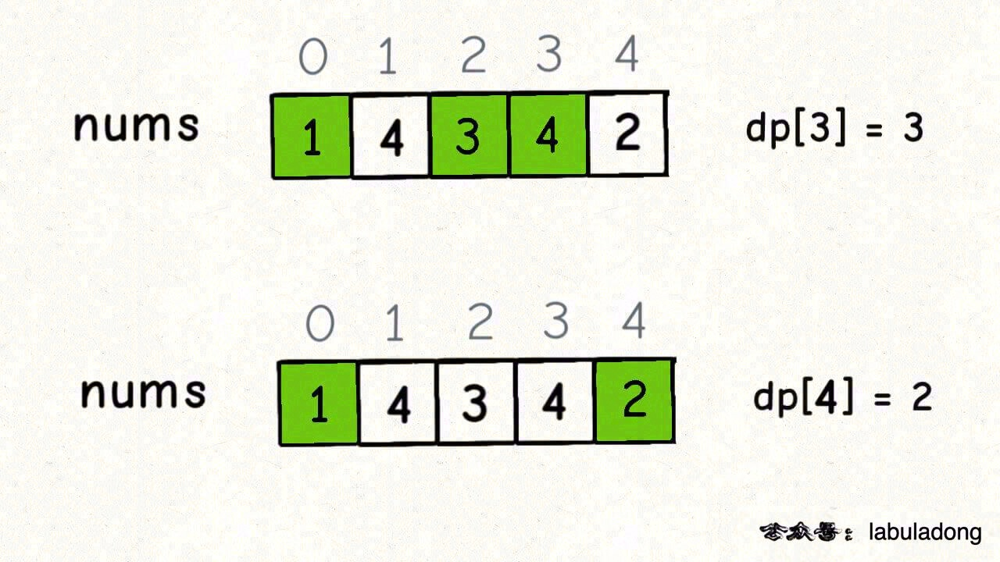
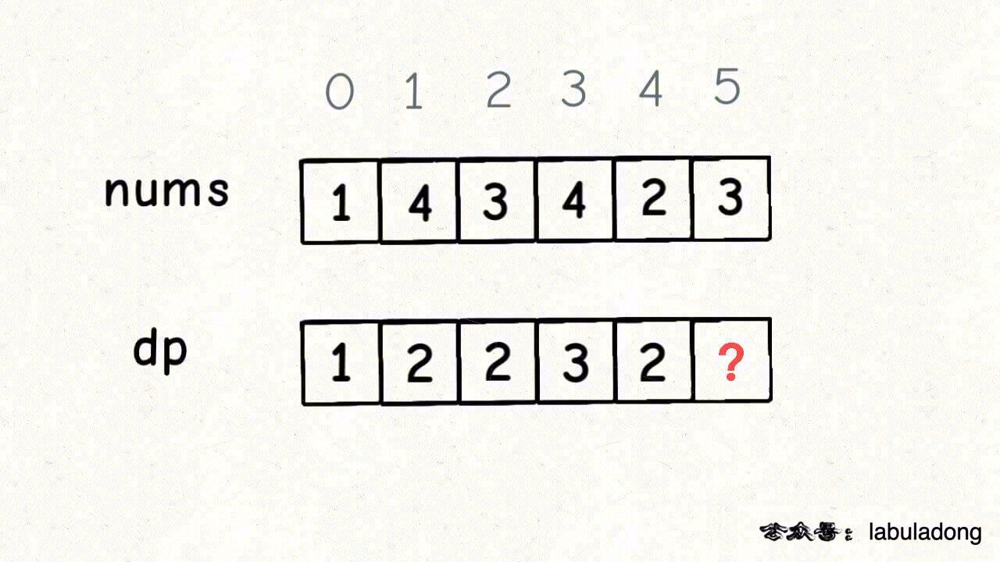
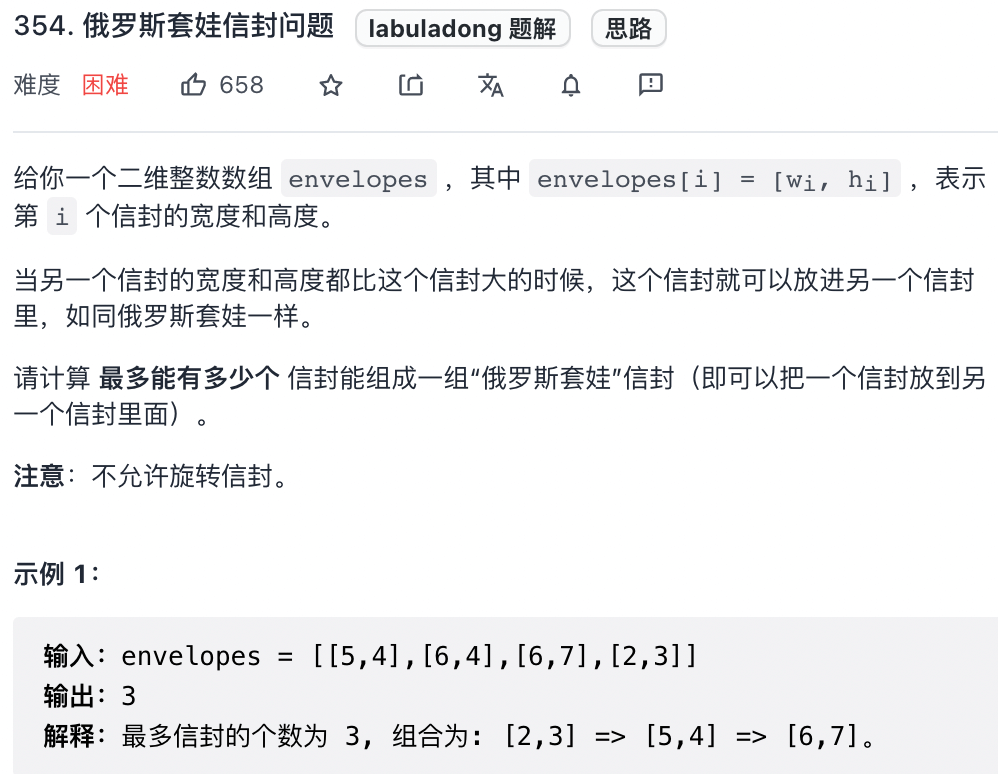

# 动态规划设计：最长递增子序列

|                            牛客网                            |                           LeetCode                           |                             力扣                             | 难度 |
| :----------------------------------------------------------: | :----------------------------------------------------------: | :----------------------------------------------------------: | :--: |
| [最长递增子序列](https://www.nowcoder.com/practice/9cf027bf54714ad889d4f30ff0ae5481?tpId=295&fromPut=pc_wzcpa_labuladong_sf) | [300. Longest Increasing Subsequence](https://leetcode.com/problems/longest-increasing-subsequence) | [300. 最长递增子序列](https://leetcode-cn.com/problems/longest-increasing-subsequence) |  🟠   |
| [俄罗斯套娃信封问题](https://www.nowcoder.com/practice/9bf77b5b018d4d24951c9a7edb40408f?tpId=295&fromPut=pc_wzcpa_labuladong_sf) | [354. Russian Doll Envelopes](https://leetcode.com/problems/russian-doll-envelopes) | [354. 俄罗斯套娃信封问题](https://leetcode-cn.com/problems/russian-doll-envelopes) |  🔴   |

本文就借助经典的「最长递增子序列问题」来讲一讲设计动态规划的通用技巧：**数学归纳思想**。

最长递增子序列（Longest Increasing Subsequence，简写 LIS）是非常经典的一个算法问题，比较容易想到的是动态规划解法，时间复杂度 O(N^2)。

我们借这个问题来由浅入深地学习以下三个问题：

* 如何找状态转移方程
* 如何写出动态规划解法。
* 比较难想到的是利用二分查找，时间复杂度是 O(NlogN)，我们通过一种简单的纸牌游戏来辅助理解这种巧妙的解法。

## 1. 最长递增子序列

力扣第 300 题「 [最长递增子序列](https://leetcode-cn.com/problems/longest-increasing-subsequence)」就是这个问题：

输入一个无序的整数数组，请你找到其中最长递增子序列的长度

比如说输入 `nums=[10,9,2,5,3,7,101,18]`，其中最长的递增子序列是 `[2,3,7,101]`，所以算法的输出应该是 4。

>  注意「子序列」和「子串」这两个名词的区别，子串一定是连续的，而子序列不一定是连续的。下面先来设计动态规划算法解决这个问题。

### 1.1 动态规划解法

动态规划的核心设计思想是数学归纳法。

数学归纳法: 

* 我们先**假设这个结论在 `k < n` 时成立，然后根据这个假设，想办法推导证明出 `k = n` 的时候此结论也成立**。如果能够证明出来，那么就说明这个结论对于 `k` 等于任何数都成立。

类似的，我们设计动态规划算法，可以假设 `dp[0...i-1]` 都已经被算出来了，然后问自己：怎么通过这些结果算出 `dp[i]`。

拿最长递增子序列这个问题举例，首先要定义清楚 dp 数组的含义，即 `dp[i]` 的值到底代表着什么？

**定义：`dp[i]` 表示以 `nums[i]` 这个数结尾的最长递增子序列的长度**。

> PS：为什么这样定义呢？这是解决子序列问题的一个套路，[动态规划之子序列问题解题模板](https://labuladong.github.io/algo/3/24/80/) 总结了几种常见套路。

根据这个定义，我们就可以推出 base case：`dp[i]` 初始值为 1，因为以 `nums[i]` 结尾的最长递增子序列起码要包含它自己。

举两个例子：



这个 GIF 展示了算法演进的过程：


根据这个定义，我们的最终结果（子序列的最大长度）应该是 dp 数组中的最大值。

**重头戏**：

**假设我们已经知道了 `dp[0..4]` 的所有结果，我们如何通过这些已知结果推出 `dp[5]` 呢**？



根据刚才我们对 `dp` 数组的定义，现在想求 `dp[5]` 的值，也就是想求以 `nums[5]` 为结尾的最长递增子序列。

**`nums[5] = 3`，既然是递增子序列，我们只要找到前面那些结尾比 3 小的子序列，然后把 3 接到这些子序列末尾，就可以形成一个新的递增子序列，而且这个新的子序列长度加一**。

```java
for (int j = 0; j < i; j++) {
    if (nums[i] > nums[j]) {
        dp[i] = Math.max(dp[i], dp[j] + 1);
    }
}
```

当 `i = 5` 时，这段代码的逻辑就可以算出 `dp[5]`。其实到这里，这道算法题我们就基本做完了。

```java
int lengthOfLIS(int[] nums) {
    // 定义：dp[i] 表示以 nums[i] 这个数结尾的最长递增子序列的长度
    int[] dp = new int[nums.length];
    // base case：dp 数组全都初始化为 1
    Arrays.fill(dp, 1);
    for (int i = 0; i < nums.length; i++) {
        for (int j = 0; j < i; j++) {
            if (nums[i] > nums[j]) 
                dp[i] = Math.max(dp[i], dp[j] + 1);
        }
    }
    
    int res = 0;
    for (int i = 0; i < dp.length; i++) {
        res = Math.max(res, dp[i]);
    }
    return res;
}
```

至此，这道题就解决了，时间复杂度 O(N^2)。总结一下如何找到动态规划的状态转移关系：

1、明确 `dp` 数组的定义。这一步对于任何动态规划问题都很重要，如果不得当或者不够清晰，会阻碍之后的步骤。

2、根据 `dp` 数组的定义，运用数学归纳法的思想，假设 `dp[0...i-1]` 都已知，想办法求出 `dp[i]`，一旦这一步完成，整个题目基本就解决了。

但如果无法完成这一步，很可能就是 `dp` 数组的定义不够恰当，需要重新定义 `dp` 数组的含义；或者可能是 `dp` 数组存储的信息还不够，不足以推出下一步的答案，需要把 `dp` 数组扩大成二维数组甚至三维数组。

### 1.2 二分查找解法(了解即可)

其实最长递增子序列和一种叫做 patience game 的纸牌游戏有关，甚至有一种排序方法就叫做 patience sorting（耐心排序）。

**处理这些扑克牌要遵循以下规则**：

只能把点数小的牌压到点数比它大的牌上；如果当前牌点数较大没有可以放置的堆，则新建一个堆，把这张牌放进去；如果当前牌有多个堆可供选择，则选择最左边的那一堆放置。

比如说上述的扑克牌最终会被分成这样 5 堆（我们认为纸牌 A 的牌面是最大的，纸牌 2 的牌面是最小的。


牌的堆数就是最长递增子序列的长度，证明略。

```java
int lengthOfLIS(int[] nums) {
    int[] top = new int[nums.length];
    // 牌堆数初始化为 0
    int piles = 0;
    for (int i = 0; i < nums.length; i++) {
        // 要处理的扑克牌
        int poker = nums[i];

        /***** 搜索左侧边界的二分查找 *****/
        int left = 0, right = piles;
        while (left < right) {
            int mid = (left + right) / 2;
            if (top[mid] > poker) {
                right = mid;
            } else if (top[mid] < poker) {
                left = mid + 1;
            } else {
                right = mid;
            }
        }
        /*********************************/
        
        // 没找到合适的牌堆，新建一堆
        if (left == piles) piles++;
        // 把这张牌放到牌堆顶
        top[left] = poker;
    }
    // 牌堆数就是 LIS 长度
    return piles;
}
```

## 2. [俄罗斯套娃信封问题](https://leetcode-cn.com/problems/russian-doll-envelopes)



**这道题目其实是最长递增子序列的一个变种，因为每次合法的嵌套是大的套小的，相当于在二维平面中找一个最长递增的子序列，其长度就是最多能嵌套的信封个数**。

前面说的标准 LIS 算法只能在一维数组中寻找最长子序列，而我们的信封是由 `(w, h)` 这样的二维数对形式表示的，如何把 LIS 算法运用过来呢？

这道题的解法比较巧妙：

**先对宽度 `w` 进行升序排序，如果遇到 `w` 相同的情况，则按照高度 `h` 降序排序；之后把所有的 `h` 作为一个数组，在这个数组上计算 LIS 的长度就是答案**。


然后在 `h` 上寻找最长递增子序列，这个子序列就是最优的嵌套方案：


首先，对宽度 `w` 从小到大排序，确保了 `w` 这个维度可以互相嵌套，所以我们只需要专注高度 `h` 这个维度能够互相嵌套即可。

其次，两个 `w` 相同的信封不能相互包含，所以对于宽度 `w` 相同的信封，对高度 `h` 进行降序排序，保证 LIS 中不存在多个 `w` 相同的信封。

```java
// envelopes = [[w, h], [w, h]...]
public int maxEnvelopes(int[][] envelopes) {
    int n = envelopes.length;
    // 按宽度升序排列，如果宽度一样，则按高度降序排列
    Arrays.sort(envelopes, new Comparator<int[]>() 
    {
        public int compare(int[] a, int[] b) {
            return a[0] == b[0] ? b[1] > a[1] : a[0] > b[0];
        }
    });
    // 对高度数组寻找 LIS
    int[] height = new int[n];
    for (int i = 0; i < n; i++)
        height[i] = envelopes[i][1];

    return lengthOfLIS(height);
}

int lengthOfLIS(int[] nums) {
    // 见前文
}
```

