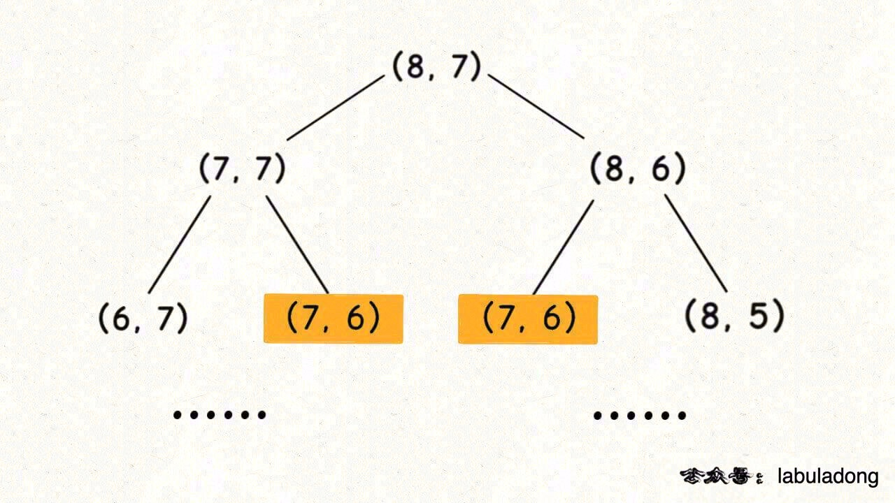
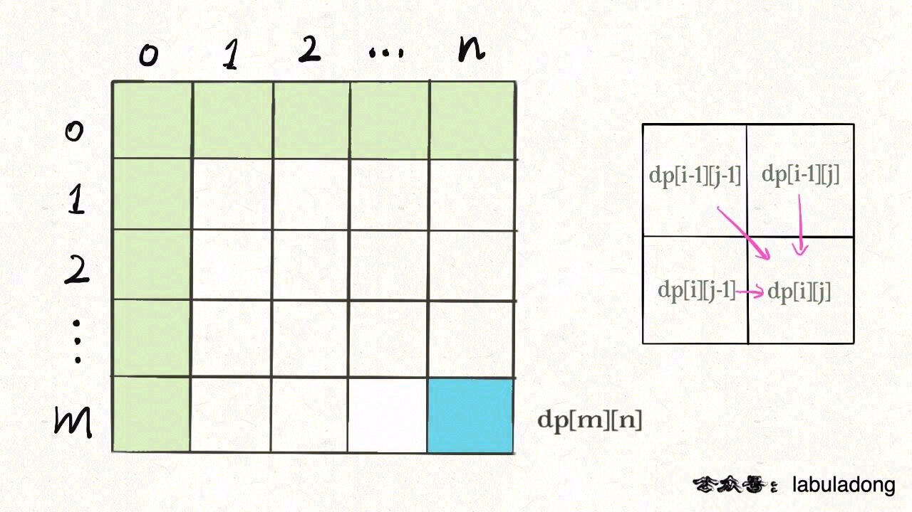
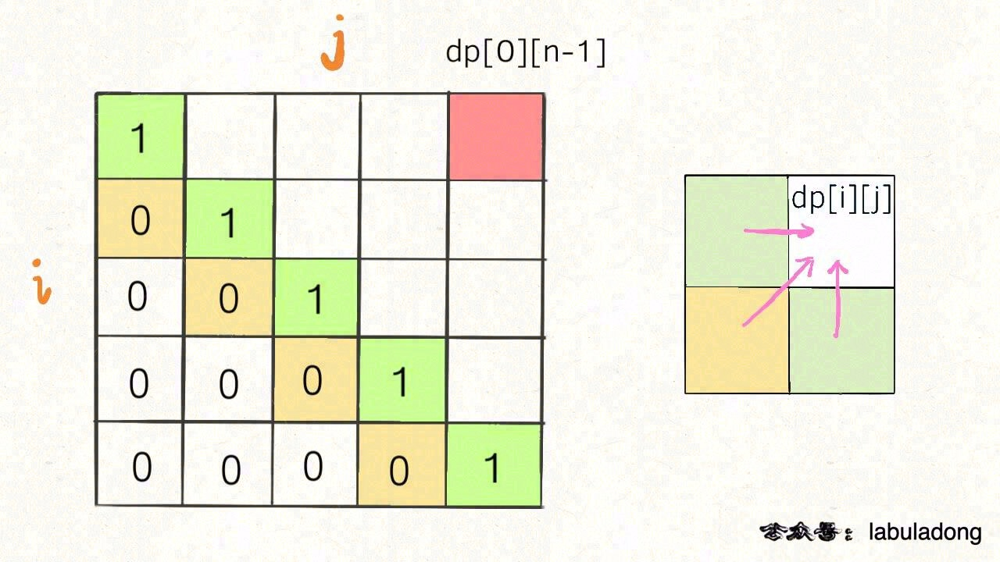
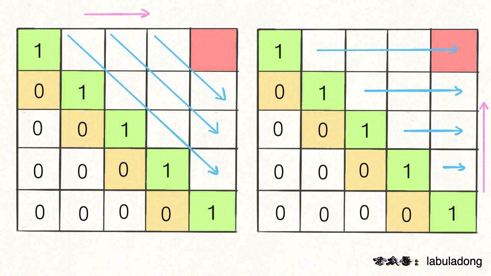

# 最优子结构原理和 DP 数组遍历方向与备忘录和base-case的初始值

视频版： [动态规划详解进阶](https://www.bilibili.com/video/BV1uv411W73P/)

这篇文章就给你讲明白三个问题：

1、到底什么才叫「最优子结构」，和动态规划什么关系。

2、如何判断一个问题是动态规划问题，即如何看出是否存在重叠子问题。

3、为什么经常看到将 `dp` 数组的大小设置为 `n + 1` 而不是 `n`。

4、为什么动态规划遍历 `dp` 数组的方式五花八门，有的正着遍历，有的倒着遍历，有的斜着遍历。

## 1. 最优子结构详解

**符合最优子结构**：可以从子问题的最优结果推出更大规模问题的最优结果。

* 例如算**每个班**的最优成绩就是子问题，你知道所有子问题的答案后，就可以借此推出**全校**学生的最优成绩这个规模更大的问题的答案。

**不符合最优子结构**：想满足最优子结，子问题之间必须互相独立。

* 假设你们学校有 10 个班，你已知每个班的最大分数差（最高分和最低分的差值）。但是我们肯定不能通过已知的这 10 个班的最大分数差推到出全校学生中的最大分数差。全校的最大分数差可能出现在两个班之间，显然子问题不独立，所以这个问题本身不符合最优子结构。

**那么遇到这种最优子结构失效情况，怎么办？**

* 策略是：改造问题

例如求一棵二叉树的最大值（假设节点中的值都是非负数）：

```java
int maxVal(TreeNode root) {
    if (root == null)
        return -1;
    int left = maxVal(root.left);
    int right = maxVal(root.right);
    return max(root.val, left, right);
}
```

这个问题也符合最优子结构，以 `root` 为根的树的最大值，可以通过两边子树（子问题）的最大值推导出来。

* 当然这也不是动态规划问题，旨在说明，最优子结构并不是动态规划独有的一种性质，能求最值的问题大部分都具有这个性质；

* 但反过来，**最优子结构性质作为动态规划问题的必要条件，一定是让你求最值的**。

动态规划就是从最简单的 base case 往后推导，只有符合最优子结构的问题，才有发生这种链式反应的性质。

找最优子结构的过程，其实就是证明状态转移方程正确性的过程，方程符合最优子结构就可以写暴力解了，写出暴力解就可以看出有没有重叠子问题了，有则优化，无则 OK。这才是套路。

## 2. 重叠子问题详解

**写出了暴力解，如何判断是否存在重叠子问题**？

* **最简单的就是画图，把递归树画出来，看看有没有重复的节点**。

比如在 [最小路径和问题](https://labuladong.github.io/algo/3/26/86/) 中，暴力解法：

```java
int dp(int[][] grid, int i, int j) {
    if (i == 0 && j == 0) {
        return grid[0][0];
    }
    if (i < 0 || j < 0) {
        return Integer.MAX_VALUE;
    }

    return Math.min(
            dp(grid, i - 1, j), 
            dp(grid, i, j - 1)
        ) + grid[i][j];
}
```

该函数递归过程中参数 `i, j` 在不断变化，即「状态」是 `(i, j)` 的值。

假设输入的 `i = 8, j = 7`，二维状态的递归树如下图，显然出现了重叠子问题：



**但其实根本没必要画图，可以通过递归框架直接判断是否存在重叠子问题**。

具体操作就是直接删掉代码细节，抽象出该解法的递归框架：

```java
int dp(int[][] grid, int i, int j) {
    dp(grid, i - 1, j), // #1
    dp(grid, i, j - 1)  // #2
}
```

显然有两种路径，可以是 `(i, j) -> #1 -> #2` 或者 `(i, j) -> #2 -> #1`，不止一种，说明 `(i-1, j-1)` 会被多次计算，所以一定存在重叠子问题。

[正则表达式问题](https://labuladong.github.io/algo/3/26/90/) 的暴力解代码：

```c++
bool dp(string& s, int i, string& p, int j) {
    int m = s.size(), n = p.size();
    if (j == n)  return i == m;
    if (i == m) {
        if ((n - j) % 2 == 1) return false;
        for (; j + 1 < n; j += 2) {
            if (p[j + 1] != '*') return false;
        }
        return true;
    }

    if (s[i] == p[j] || p[j] == '.') {
        if (j < n - 1 && p[j + 1] == '*') {
            return dp(s, i, p, j + 2)
               || dp(s, i + 1, p, j);
        } else {
            return dp(s, i + 1, p, j + 1);
        }
    } else if (j < n - 1 && p[j + 1] == '*') {
        return dp(s, i, p, j + 2);
    }
    return false;
}
```

抽象框架：

```c++
bool dp(string& s, int i, string& p, int j) {
    dp(s, i, p, j + 2);     // #1
    dp(s, i + 1, p, j);     // #2
    dp(s, i + 1, p, j + 1); // #3
    dp(s, i, p, j + 2);     // #4
}
```

所以，不用画图就知道这个解法也存在重叠子问题，需要用备忘录技巧去优化。

## 3. `dp` 数组的大小设置

比如说前文 [编辑距离问题](https://labuladong.github.io/algo/3/24/76/)，自顶向下的递归解法，实现了这样一个 `dp` 函数：

```java
int minDistance(String s1, String s2) {
    int m = s1.length(), n = s2.length();
    // 按照 dp 函数的定义，计算 s1 和 s2 的最小编辑距离
    return dp(s1, m - 1, s2, n - 1);
}

// 定义：s1[0..i] 和 s2[0..j] 的最小编辑距离是 dp(s1, i, s2, j)
int dp(String s1, int i, String s2, int j) {
    // 处理 base case
    if (i == -1) {
        return j + 1;
    }
    if (j == -1) {
        return i + 1;
    }

    // 进行状态转移
    if (s1.charAt(i) == s2.charAt(j)) {
        return dp(s1, i - 1, s2, j - 1);
    } else {
        return min(
            dp(s1, i, s2, j - 1) + 1,
            dp(s1, i - 1, s2, j) + 1,
            dp(s1, i - 1, s2, j - 1) + 1
        );
    }
}
```

然后改造成了自底向上的迭代解法：

```java
int minDistance(String s1, String s2) {
    int m = s1.length(), n = s2.length();
    // 定义：s1[0..i] 和 s2[0..j] 的最小编辑距离是 dp[i+1][j+1]
    int[][] dp = new int[m + 1][n + 1];
    // 初始化 base case 
    for (int i = 1; i <= m; i++)
        dp[i][0] = i;
    for (int j = 1; j <= n; j++)
        dp[0][j] = j;
    
    // 自底向上求解
    for (int i = 1; i <= m; i++) {
        for (int j = 1; j <= n; j++) {
            // 进行状态转移
            if (s1.charAt(i-1) == s2.charAt(j-1)) {
                dp[i][j] = dp[i - 1][j - 1];
            } else {
                dp[i][j] = min(
                    dp[i - 1][j] + 1,
                    dp[i][j - 1] + 1,
                    dp[i - 1][j - 1] + 1
                );
            }
        }
    }
    // 按照 dp 数组的定义，存储 s1 和 s2 的最小编辑距离
    return dp[m][n];
}
```

**理论上，你怎么定义都可以，只要根据定义处理好 base case 就可以**。

你看 `dp` 函数的定义，`dp(s1, i, s2, j)` 计算 `s1[0..i]` 和 `s2[0..j]` 的编辑距离，那么 `i, j` 等于 -1 时代表空串的 base case，所以函数开头处理了这两种特殊情况。

再看 `dp` 数组，你当然也可以定义 `dp[i][j]` 存储 `s1[0..i]` 和 `s2[0..j]` 的编辑距离，但问题是 base case 怎么搞？索引怎么能是 -1 呢？

所以我们把 `dp` 数组初始化为 `int[m+1][n+1]`，让索引整体偏移一位，把索引 0 留出来作为 base case 表示空串，然后定义 `dp[i+1][j+1]` 存储 `s1[0..i]` 和 `s2[0..j]` 的编辑距离。

## 4. `dp` 数组的遍历方向

做动态规问题时，肯定会对 `dp` 数组的遍历顺序有些头疼。我们拿二维 `dp` 数组来举例，有时候我们是正向遍历：

```java
int[][] dp = new int[m][n];
for (int i = 0; i < m; i++)
    for (int j = 0; j < n; j++)
        // 计算 dp[i][j]
```

有时候我们反向遍历：

```java
for (int i = m - 1; i >= 0; i--)
    for (int j = n - 1; j >= 0; j--)
        // 计算 dp[i][j]
```

有时候可能会斜向遍历：

```java
// 斜着遍历数组
for (int l = 2; l <= n; l++) {
    for (int i = 0; i <= n - l; i++) {
        int j = l + i - 1;
        // 计算 dp[i][j]
    }
}
```

比如我们在 [团灭股票问题](https://labuladong.github.io/algo/3/26/96/) 中有的地方就正反皆可。

那么，如果仔细观察的话可以发现其中的原因的。你只要把住两点就行了：

**1、遍历的过程中，所需的状态必须是已经计算出来的**。

**2、遍历结束后，存储结果的那个位置必须已经被计算出来**。

比如编辑距离这个经典的问题，详解见前文 [编辑距离详解](https://labuladong.github.io/algo/3/24/76/)，我们通过对 `dp` 数组的定义，确定了 base case 是 `dp[..][0]` 和 `dp[0][..]`，最终答案是 `dp[m][n]`；而且我们通过状态转移方程知道 `dp[i][j]` 需要从 `dp[i-1][j]`, `dp[i][j-1]`, `dp[i-1][j-1]` 转移而来，如下图：

* 答案只能是正向遍历。



回文子序列问题，详见前文 [子序列问题模板](https://labuladong.github.io/algo/3/24/80/)，我们通过过对 `dp` 数组的定义，确定了 base case 处在中间的对角线，`dp[i][j]` 需要从 `dp[i+1][j]`, `dp[i][j-1]`, `dp[i+1][j-1]` 转移而来，想要求的最终答案是 `dp[0][n-1]`，如下图：



根据刚才的两个原则，就可以有两种正确的遍历方式：



## 5. BASE CASE 和备忘录的初始值

| 牛客网 |                           LeetCode                           |                             力扣                             | 难度 |
| :----: | :----------------------------------------------------------: | :----------------------------------------------------------: | :--: |
|   -    | [931. Minimum Falling Path Sum](https://leetcode.com/problems/minimum-falling-path-sum/) | [931. 下降路径最小和](https://leetcode-cn.com/problems/minimum-falling-path-sum/) |  🟠   |

力扣第 931 题「 [下降路径最小和](https://leetcode-cn.com/problems/minimum-falling-path-sum/)」，输入为一个 `n * n` 的二维数组 `matrix`，请你计算从第一行落到最后一行，经过的路径和最小为多少。

你可以站在 `matrix` 的第一行的任意一个元素，需要下降到最后一行。

每次下降，可以向下、向左下、向右下三个方向移动一格。也就是说，可以从 `matrix[i][j]` 降到 `matrix[i+1][j]` 或 `matrix[i+1][j-1]` 或 `matrix[i+1][j+1]` 三个位置。

请你计算下降的「最小路径和」，比如说题目给了一个例子：


**我们借这道题来讲讲 base case 的返回值、备忘录的初始值、索引越界情况的返回值如何确定**。

通过 [动态规划的标准套路](https://labuladong.github.io/algo/3/23/68/) 学习到的解题思路，首先我们可以定义一个 `dp` 数组：

```java
int dp(int[][] matrix, int i, int j);
```

这个 `dp` 函数的含义如下：

**从第一行（`matrix[0][..]`）向下落，落到位置 `matrix[i][j]` 的最小路径和为 `dp(matrix, i, j)`**。

根据这个定义，我们可以把主函数的逻辑写出来：

```java
int minFallingPathSum(int[][] matrix) {
    int n = matrix.length;
    int res = Integer.MAX_VALUE;

    // 终点可能在最后一行的任意一列
    for (int j = 0; j < n; j++) {
        res = Math.min(res, dp(matrix, n - 1, j));
    }

    return res;
}
```

**那么，只要知道到达 `(i-1, j), (i-1, j-1), (i-1, j+1)` 这三个位置的最小路径和，加上 `matrix[i][j]` 的值，就能够计算出来到达位置 `(i, j)` 的最小路径和**：

```java
int dp(int[][] matrix, int i, int j) {
    // 非法索引检查
    if (i < 0 || j < 0 ||
        i >= matrix.length ||
        j >= matrix[0].length) {
        // 返回一个特殊值
        return 99999;
    }
    // base case
    if (i == 0) {
        return matrix[i][j];
    }
    // 状态转移
    return matrix[i][j] + min(
            dp(matrix, i - 1, j), 
            dp(matrix, i - 1, j - 1),
            dp(matrix, i - 1, j + 1)
        );
}

int min(int a, int b, int c) {
    return Math.min(a, Math.min(b, c));
}
```

当然，上述代码是暴力穷举解法，我们可以用备忘录的方法消除重叠子问题，完整代码如下：

```java
int minFallingPathSum(int[][] matrix) {
    int n = matrix.length;
    int res = Integer.MAX_VALUE;
    // 备忘录里的值初始化为 66666
    memo = new int[n][n];
    for (int i = 0; i < n; i++) {
        Arrays.fill(memo[i], 66666);
    }
    // 终点可能在 matrix[n-1] 的任意一列
    for (int j = 0; j < n; j++) {
        res = Math.min(res, dp(matrix, n - 1, j));
    }
    return res;
}

// 备忘录
int[][] memo;

int dp(int[][] matrix, int i, int j) {
    // 1、索引合法性检查
    if (i < 0 || j < 0 ||
        i >= matrix.length ||
        j >= matrix[0].length) {
        
        return 99999;
    }
    // 2、base case
    if (i == 0) {
        return matrix[0][j];
    }
    // 3、查找备忘录，防止重复计算
    if (memo[i][j] != 66666) {
        return memo[i][j];
    }
    // 进行状态转移
    memo[i][j] = matrix[i][j] + min(
            dp(matrix, i - 1, j), 
            dp(matrix, i - 1, j - 1),
            dp(matrix, i - 1, j + 1)
        );
    return memo[i][j];
}

int min(int a, int b, int c) {
    return Math.min(a, Math.min(b, c));
}
```

**那么本文对于这个 `dp` 函数仔细探讨三个问题**：

1. 对于索引的合法性检测，返回值为什么是 99999？

2. base case 为什么是 `i == 0`？

3. 备忘录 `memo` 的初始值为什么是 66666？

**首先，说说 base case 为什么是 `i == 0`，返回值为什么是 `matrix[0][j]`，这是根据 `dp` 函数的定义所决定的**。

回顾我们的 `dp` 函数定义：

从第一行（`matrix[0][..]`）向下落，落到位置 `matrix[i][j]` 的最小路径和为 `dp(matrix, i, j)`。

根据这个定义，我们就是从 `matrix[0][j]` 开始下落。那如果我们想落到的目的地就是 `i == 0`，所需的路径和当然就是 `matrix[0][j]` 呗。

**再说说备忘录 `memo` 的初始值为什么是 66666，这是由题目给出的数据范围决定的**。

备忘录 `memo` 数组的作用是什么？

就是防止重复计算，将 `dp(matrix, i, j)` 的计算结果存进 `memo[i][j]`，遇到重复计算可以直接返回。

所以，`memo` 的初始值一定得是特殊值，和合法的答案有所区分。

我们回过头看看题目给出的数据范围：

> `matrix` 是 `n x n` 的二维数组，其中 `1 <= n <= 100`；对于二维数组中的元素，有 `-100 <= matrix[i][j] <= 100`。

假设 `matrix` 的大小是 100 x 100，所有元素都是 100，那么从第一行往下落，得到的路径和就是 100 x 100 = 10000，也就是最大的合法答案。

也就是说，这个问题的合法结果会落在区间 `[-10000, 10000]` 中。

所以，`memo` 的初始值只要在区间 `(-inf, -10001] U [10001, +inf)` 中就可以。

**最后，说说对于不合法的索引，返回值应该如何确定，这需要根据我们状态转移方程的逻辑确定**。

对于这道题，状态转移的基本逻辑如下：

```java
int dp(int[][] matrix, int i, int j) {

    return matrix[i][j] + min(
            dp(matrix, i - 1, j), 
            dp(matrix, i - 1, j - 1),
            dp(matrix, i - 1, j + 1)
        );
}
```

显然，`i - 1, j - 1, j + 1` 这几个运算可能会造成索引越界，对于索引越界的 `dp` 函数，应该返回一个不可能被取到的值。

因为我们调用的是 `min` 函数，最终返回的值是最小值，所以对于不合法的索引，只要 `dp` 函数返回一个永远不会被取到的最大值即可。

刚才说了，合法答案的区间是 `[-10000, 10000]`，所以我们的返回值只要大于 10000 就相当于一个永不会取到的最大值。

换句话说，只要返回区间 `[10001, +inf)` 中的一个值，就能保证不会被取到。