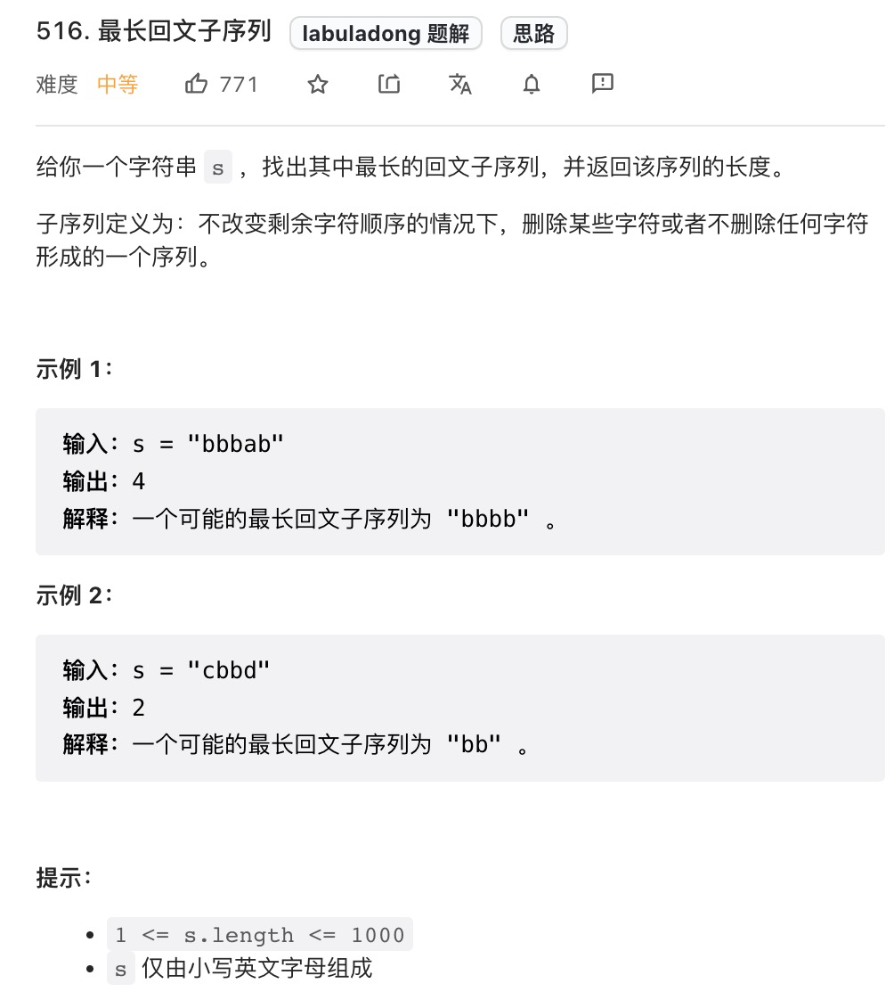
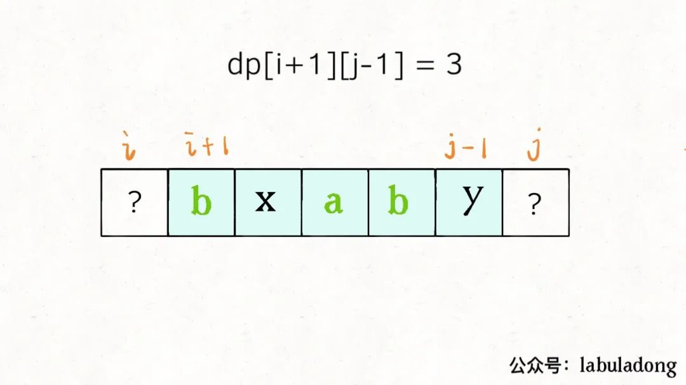
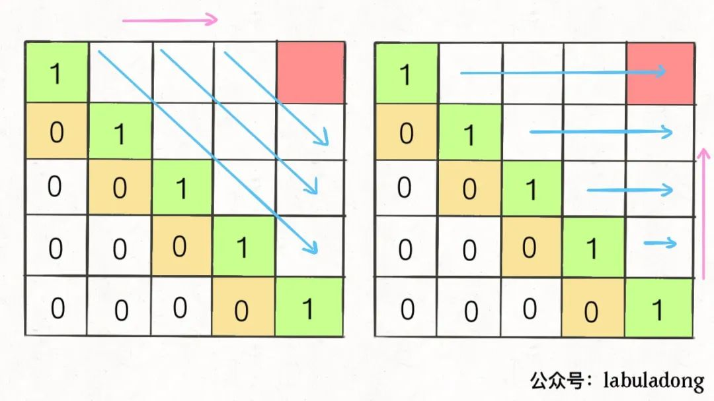
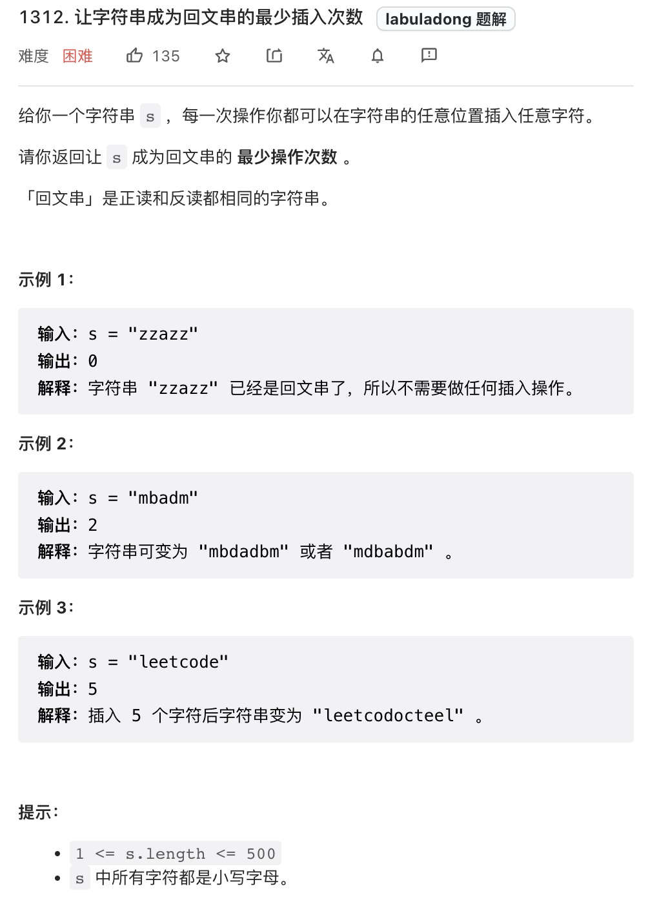

# 动态规划之子序列问题模版

|                            牛客网                            |                           LeetCode                           |                             力扣                             | 难度 |
| :----------------------------------------------------------: | :----------------------------------------------------------: | :----------------------------------------------------------: | :--: |
| [最长回文子序列](https://www.nowcoder.com/practice/c7fc893654b44324b6763dea095ceaaf?tpId=295&fromPut=pc_wzcpa_labuladong_sf) | [516. Longest Palindromic Subsequence](https://leetcode.com/problems/longest-palindromic-subsequence) | [516. 最长回文子序列](https://leetcode-cn.com/problems/longest-palindromic-subsequence) |  🟠   |
| [让字符串成为回文串的最少插入次数](https://www.nowcoder.com/practice/f6b2e405d2364684bcc59b97f43a1c8f?tpId=295&fromPut=pc_wzcpa_labuladong_sf) | [1312. Minimum Insertion Steps to Make a String Palindrome](https://leetcode.com/problems/minimum-insertion-steps-to-make-a-string-palindrome) | [1312. 让字符串成为回文串的最少插入次数](https://leetcode-cn.com/problems/minimum-insertion-steps-to-make-a-string-palindrome) |  🔴   |

子序列问题：

* 一般求最长子序列，考察的就是动态规划，时间复杂度为`O(N^2)`

两种思路就是两种定义`dp`数组的思路。

## 1. 两种思路

### 1.1 第一种思路：一维的`dp`数组

```java
int n = array.length;
int[] dp = new int[n];

for(int i=1; i<n; ++i){
  for(int j=0; j<i; ++j){
    dp[i] = 最值(dp[i], dp[j]...)
  }
}
```

比如最长递增子序列和最大子数组和都是这个思路。

`dp[i]`定义：

在子数组`arr[0..i]`中，我们要求的子序列的长度是`dp[i]`。

### 1.2 第二种思路：二维的`dp`数组

```java
int n = array.length;
int[][] dp = new int[n][n];

for(int i=0; i<n; ++i){
  for(int j=0; j<n; ++j){
    if(arr[i]==arr[j])
    	dp[i][j] = dp[i][j]+...
    else
      dp[i][j] = 最值(...)
  }
}
```

这种思路相对更多，尤其设计两个字符串或者数组的子序列时候。比如**最长公共子序列**和**编辑距离**；这种思路也设计一个字符串和数组情况，如**回文子序列**问题。

####  1.2.1 两个字符串或数组的`dp[i][j]`定义

在子数组`arr1[0..i]`和子数组`arr2[0..i]`中我们要求的子序列长度为`dp[i][j]`。

#### 1.2.2 只有一个字符串或数组的`dp[i][j]`定义

在子数组`arr[i..j]`中我们要求的子序列长度为`dp[i][j]`。

## 2. 最长回文子序列

力扣第[516. 最长回文子序列](https://leetcode-cn.com/problems/longest-palindromic-subsequence)



思路：

`dp`数组的定义是: 

* **在子串`arr[i..j]`中我们要求的回文子序列长度为`dp[i][j]`**。



可以这取决于`s[i]`和`s[j]`。

* 假如这两者相等，则`d[i][j]=dp[i+1]dp[j-1]+2`
* 不相等，说明不能同时出现在`s[i...j]`的最长回文子序列中，将他们两分别加入`s[i+1...j-1]`，最后取大者即可，如下图。


`dp函数`写成代码

```java
if(s[i]==s[j])
  // 相等则直接加入
  d[i][j]=dp[i+1]dp[j-1]+2 
else
  // 分别加入，取大值
  d[i][j] = max(dp[i+1]dp[j], dp[i]dp[j-1])
```

最后我们要求的答案就是`dp[0]dp[n-1]`

## 3. 代码实现



遍历方式有两种，选择反着遍历。

```java
class Solution {
    public int longestPalindromeSubseq(String s) {
        int n = s.length();
        if(n==1) return 1;
        
        int[][] dp = new int[n][n]; //dp[i][j] is the longest Palindrome Subseq of s[i..j]
        
        // init dp table base case
        for(int i=0; i<n; ++i){
            dp[i][i] = 1;
        }

        for(int i=n-1; i>=0; --i){
            for(int j=i+1; j<n; ++j){
                //状态转移方程
                if(s.charAt(i)==s.charAt(j)){
                    dp[i][j] = dp[i+1][j-1] + 2;
                } 
                else{
                    dp[i][j] = Math.max(dp[i+1][j], dp[i][j-1]);
                }
            }
        }
        return dp[0][n-1];
    }
}
```

## 4. 拓展延伸

比如[1312. 让字符串成为回文串的最少插入次数](https://leetcode-cn.com/problems/minimum-insertion-steps-to-make-a-string-palindrome)也可以按同样的思路做掉了。



思路：

`dp`数组的定义是: 

* **在子串`arr[i..j]`中使其成为回文子序列长度进行插入操作数量最少为`dp[i][j]`**。

```java
class Solution {
    public int minInsertions(String s) {
        int n = s.length();
        if(n==1) return 0;

        int[][] dp = new int[n][n]; // dp 数组的basecase 全是0；

        for(int i=n-1; i>=0; --i){
            for(int j=i+1; j<n; ++j){
                if(s.charAt(i)==s.charAt(j)){
                    dp[i][j] = dp[i+1][j-1];
                }else{
                    dp[i][j] = Math.min(dp[i][j-1], dp[i+1][j]) + 1;
                }
            }
        }

        return dp[0][n-1];
    }
}
```

