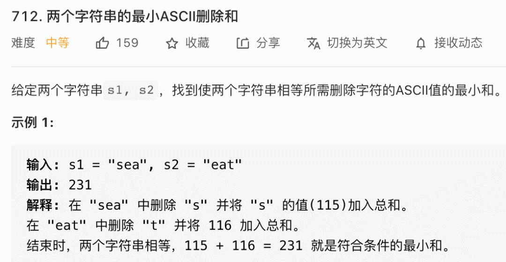

# 经典动态规划：最长公共子序列

|                            牛客网                            |                           LeetCode                           |                             力扣                             | 难度 |
| :----------------------------------------------------------: | :----------------------------------------------------------: | :----------------------------------------------------------: | :--: |
| [最长公共子序列](https://www.nowcoder.com/practice/8cb175b803374e348a614e34b80ae191?tpId=295&fromPut=pc_wzcpa_labuladong_sf) | [1143. Longest Common Subsequence](https://leetcode.com/problems/longest-common-subsequence) | [1143. 最长公共子序列](https://leetcode-cn.com/problems/longest-common-subsequence) |  🟠   |
|                              -                               | [583. Delete Operation for Two Strings](https://leetcode.com/problems/delete-operation-for-two-strings/) | [583. 两个字符串的删除操作](https://leetcode-cn.com/problems/delete-operation-for-two-strings/) |  🟠   |
|                              -                               | [712. Minimum ASCII Delete Sum for Two Strings](https://leetcode.com/problems/minimum-ascii-delete-sum-for-two-strings) | [712. 两个字符串的最小ASCII删除和](https://leetcode-cn.com/problems/minimum-ascii-delete-sum-for-two-strings) |  🟠   |

**做算法题的技巧就是，把大的问题细化到一个点，先研究在这个小的点上如何解决问题，然后再通过递归/迭代的方式扩展到整个问题**。

比如说我们前文 [手把手带你刷二叉树第三期](https://labuladong.github.io/algo/2/19/37/)，解决二叉树的题目，我们就会把整个问题细化到某一个节点上，想象自己站在某个节点上，需要做什么，然后套二叉树递归框架就行了。

动态规划系列问题也是一样，尤其是子序列相关的问题。**本文从「最长公共子序列问题」展开，总结三道子序列问题**，解这道题仔细讲讲这种子序列问题的套路。

## 1. 最长公共子序列

计算最长公共子序列（Longest Common Subsequence，简称 LCS）是一道经典的动态规划题目，大家应该都见过：

给你输入两个字符串 `s1` 和 `s2`，请你找出他们俩的最长公共子序列，返回这个子序列的长度。

比如说输入 `s1 = "zabcde", s2 = "acez"`，它俩的最长公共子序列是 `lcs = "ace"`，长度为 3，所以算法返回 3。

暴力算法

正确的思路是不要考虑整个字符串，而是细化到 `s1` 和 `s2` 的每个字符。前文 [子序列解题模板](https://labuladong.github.io/algo/3/24/80/) 中总结的一个规律：

**对于两个字符串求子序列的问题，都是用两个指针`i`和`j`分别在两个字符串上移动，大概率是动态规划思路**。

最长公共子序列的问题也可以遵循这个规律，我们可以先写一个`dp`函数：

```
// 定义：计算 s1[i..] 和 s2[j..] 的最长公共子序列长度
int dp(String s1, int i, String s2, int j)
```

这个`dp`函数的定义是：**`dp(s1, i, s2, j)`计算`s1[i..]`和`s2[j..]`的最长公共子序列长度**。

根据这个定义，那么我们想要的答案就是`dp(s1, 0, s2, 0)`，且 base case 就是`i == len(s1)`或`j == len(s2)`时，因为这时候`s1[i..]`或`s2[j..]`就相当于空串了，最长公共子序列的长度显然是 0。

**接下来看`s1`和`s2`两个字符串，而是要具体到每一个字符，思考每个字符该做什么**。

我们只看`s1[i]`和`s2[j]`，**如果`s1[i] == s2[j]`，说明这个字符一定在`lcs`中**：


但如果**`s1[i] != s2[j]`意味着，`s1[i]`和`s2[j]`中至少有一个字符不在`lcs`中**：


如上图，总共可能有三种情况。那就把这三种情况的答案都算出来，取其中结果最大的那个呗，因为题目让我们算「最长」公共子序列的长度嘛。

而且**情况三被情况一和情况二包含了**，完整代码如下：

```java
// 备忘录，消除重叠子问题
int[][] memo;

/* 主函数 */
int longestCommonSubsequence(String s1, String s2) {
    int m = s1.length(), n = s2.length();
    // 备忘录值为 -1 代表未曾计算
    memo = new int[m][n];
    for (int[] row : memo) 
        Arrays.fill(row, -1);
    // 计算 s1[0..] 和 s2[0..] 的 lcs 长度
    return dp(s1, 0, s2, 0);
}

// 定义：计算 s1[i..] 和 s2[j..] 的最长公共子序列长度
int dp(String s1, int i, String s2, int j) {
    // base case
    if (i == s1.length() || j == s2.length()) {
        return 0;
    }
    // 如果之前计算过，则直接返回备忘录中的答案
    if (memo[i][j] != -1) {
        return memo[i][j];
    }
    // 根据 s1[i] 和 s2[j] 的情况做选择
    if (s1.charAt(i) == s2.charAt(j)) {
        // s1[i] 和 s2[j] 必然在 lcs 中
        memo[i][j] = 1 + dp(s1, i + 1, s2, j + 1);
    } else {
        // s1[i] 和 s2[j] 至少有一个不在 lcs 中
        memo[i][j] = Math.max(
            dp(s1, i + 1, s2, j),
            dp(s1, i, s2, j + 1)
        );
    }
    return memo[i][j];
}
```

以上思路完全就是按照**动态规划套路框架**来的，应该是很容易理解的。至于为什么要加`memo`备忘录，我们之前写过很多次，为了照顾新来的读者，这里再简单重复一下，首先抽象出我们核心`dp`函数的递归框架：

```java
int dp(int i, int j) {
    dp(i + 1, j + 1); // #1
    dp(i, j + 1);     // #2
    dp(i + 1, j);     // #3
}
```

你看，假设我想从`dp(i, j)`转移到`dp(i+1, j+1)`，有不止一种方式，可以直接走`#1`，也可以走`#2 -> #3`，也可以走`#3 -> #2`。

这就是重叠子问题，如果我们不用`memo`备忘录消除子问题，那么`dp(i+1, j+1)`就会被多次计算，这是没有必要的。

我们当然也可以使用自底向上的迭代的动态规划思路，和我们的递归思路一样，关键是如何定义`dp`数组，我这里也写一下自底向上的解法吧：

```java
int longestCommonSubsequence(String s1, String s2) {
    int m = s1.length(), n = s2.length();
    int[][] dp = new int[m + 1][n + 1];
    // 定义：s1[0..i-1] 和 s2[0..j-1] 的 lcs 长度为 dp[i][j]
    // 目标：s1[0..m-1] 和 s2[0..n-1] 的 lcs 长度，即 dp[m][n]
    // base case: dp[0][..] = dp[..][0] = 0

    for (int i = 1; i <= m; i++) {
        for (int j = 1; j <= n; j++) {
            // 现在 i 和 j 从 1 开始，所以要减一
            if (s1.charAt(i - 1) == s2.charAt(j - 1)) {
                // s1[i-1] 和 s2[j-1] 必然在 lcs 中
                dp[i][j] = 1 + dp[i - 1][j - 1];
            } else {
                // s1[i-1] 和 s2[j-1] 至少有一个不在 lcs 中
                dp[i][j] = Math.max(dp[i][j - 1], dp[i - 1][j]);
            }
        }
    }
    return dp[m][n];
}
```

自底向上的解法中`dp`数组定义的方式和我们的递归解法有一点差异，而且由于数组索引从 0 开始，有索引偏移。

另外，自底向上的解法可以通过我们前文讲过的**动态规划状态压缩技巧**来进行优化，把空间复杂度压缩为 O(N)，这里由于篇幅所限，就不展开了。

## 2. 字符串的删除操作

力扣第[583. 两个字符串的删除操作](https://leetcode-cn.com/problems/delete-operation-for-two-strings/)。

```java
class Solution {
    int[][] memo;

    public int minDistance(String word1, String word2) {
        int n = word1.length(), m = word2.length();
        memo = new int[n][m];
        for(int[] row : memo){
            Arrays.fill(row, -1);
        }
        return dp(word1, word2, n-1, m-1);
    }

    // s1[...i] s2[...j] 删除到一样的最小步骤
    int dp(String s1, String s2, int i, int j){
        //base case
        if(i==-1) return j+1;
        if(j==-1) return i+1;
        if(memo[i][j]!=-1) return memo[i][j];

        if(s1.charAt(i)==s2.charAt(j)){
            memo[i][j] = dp(s1, s2, i-1, j-1);
        }else{
            memo[i][j] = 1 + Math.min(dp(s1, s2, i-1, j), dp(s1, s2, i, j-1));
        }
        return memo[i][j];
    }
}
```

## 3. 最小ASCII删除和

[712. 两个字符串的最小ASCII删除和](https://leetcode-cn.com/problems/minimum-ascii-delete-sum-for-two-strings)



在前一题的情况下，修改`base case` 和 `dp函数`即可。

```java
class Solution {
    int[][] memo; //备忘录

    public int minimumDeleteSum(String s1, String s2) {
        int n = s1.length(), m = s2.length();
        memo = new int[n][m];
        for(int[] row : memo){
            Arrays.fill(row, -1);
        }
        return dp(s1, s2, n-1, m-1);
    }

     // s1[...i] s2[...j] 删除到一样的最小ASCII值
    int dp(String s1, String s2, int i, int j){
        //base case
        if(i==-1){
            int res=0;
            for(int k=0; k<=j; k++){
                res += s2.charAt(k);
            }
            return res;
        }
        if(j==-1){
            int res=0;
            for(int k=0; k<=i; ++k){
                res += s1.charAt(k);
            }
            return res;
        }

        if(memo[i][j]!=-1) return memo[i][j];

        if(s1.charAt(i)==s2.charAt(j)){
            memo[i][j] = dp(s1, s2, i-1, j-1);
        }else{
            memo[i][j] = Math.min(s1.charAt(i) + dp(s1, s2, i-1, j), s2.charAt(j) + dp(s1, s2, i, j-1));
        }
        return memo[i][j];
    }
}
```

