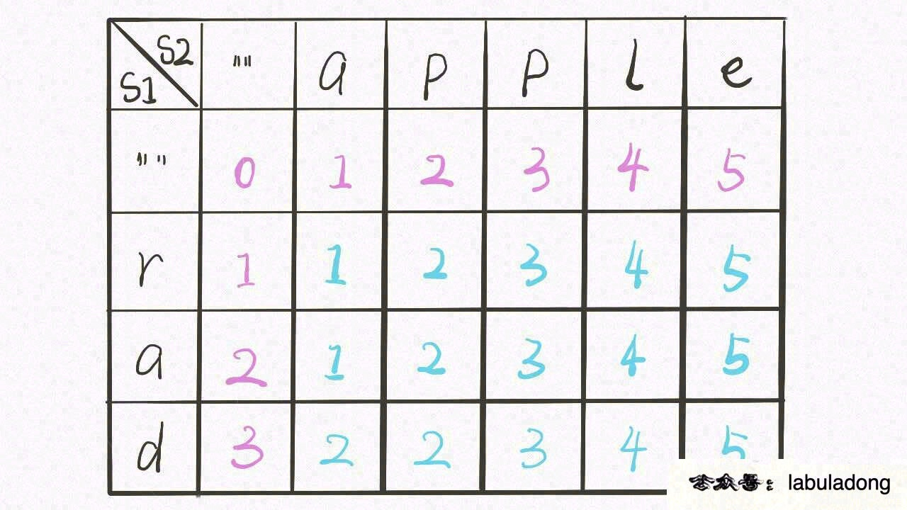
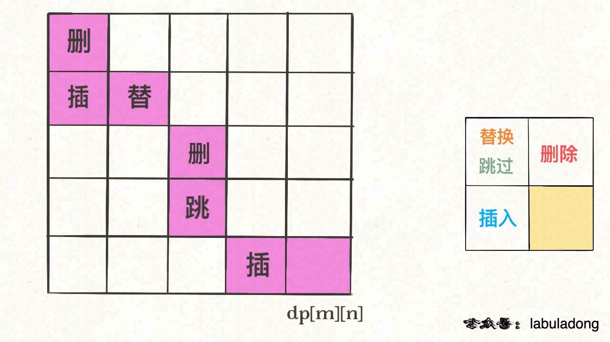

# 经典动态规划-编辑距离

|                            牛客网                            |                           LeetCode                           |                             力扣                             | 难度 |
| :----------------------------------------------------------: | :----------------------------------------------------------: | :----------------------------------------------------------: | :--: |
| [编辑距离](https://www.nowcoder.com/practice/6a1483b5be1547b1acd7940f867be0da?tpId=295&fromPut=pc_wzcpa_labuladong_sf) | [72. Edit Distance](https://leetcode.com/problems/edit-distance) | [72. 编辑距离](https://leetcode-cn.com/problems/edit-distance) |  🔴   |

视频版： [编辑距离详解动态规划](https://www.bilibili.com/video/BV1uv411W73P/)

> 一份鹅厂的面试题，算法部分大半是动态规划，最后一题就是写一个计算编辑距离的函数。

力扣第 72 题「 [编辑距离](https://leetcode-cn.com/problems/edit-distance)」就是这个问题，先看下题目：


## 1. 思路

编辑距离问题就是给我们两个字符串 `s1` 和 `s2`，只能用三种操作，让我们把 `s1` 变成 `s2`，求最少的操作数。需要明确的是，不管是把 `s1` 变成 `s2` 还是反过来，结果都是一样的，所以后文就以 `s1` 变成 `s2` 举例。

前文 [最长公共子序列](https://labuladong.github.io/algo/3/24/79/) 说过，**解决两个字符串的动态规划问题，一般都是用两个指针 `i, j` 分别指向两个字符串的最后，然后一步步往前移动，缩小问题的规模**。

> PS：其实让 `i, j` 从前往后移动也可以，改一下 `dp` 函数/数组的定义即可，思路是完全一样的。

设两个字符串分别为 `"rad"` 和 `"apple"`，为了把 `s1` 变成 `s2`，算法会这样进行：


根据上面的 GIF，可以发现操作不只有三个，其实还有第四个操作，就是什么都不要做（skip）。比如当两个字符本来就相同，为了使编辑距离最小，显然不应该对它们有任何操作，直接往前移动 `i, j` 即可。

还有一个很容易处理的情况，就是 `j` 走完 `s2` 时，如果 `i` 还没走完 `s1`，那么只能用删除操作把 `s1` 缩短为 `s2`。

类似的，如果 `i` 走完 `s1` 时 `j` 还没走完了 `s2`，那就只能用插入操作把 `s2` 剩下的字符全部插入 `s1`。等会会看到，这两种情况就是算法的 **base case**。

下面详解一下如何将思路转换成代码，坐稳，要发车了。

## 2. 代码详解

base case 是 `i` 走完 `s1` 或 `j` 走完 `s2`，可以直接返回另一个字符串剩下的长度。

对于每对儿字符 `s1[i]` 和 `s2[j]`，可以有四种操作：

```java
if s1[i] == s2[j]:
    啥都别做（skip）
    i, j 同时向前移动
else:
    三选一：
        插入（insert）
        删除（delete）
        替换（replace）
```

这个「三选一」到底该怎么选择呢？很简单，全试一遍，哪个操作最后得到的编辑距离最小，就选谁。这里需要递归技巧，理解需要点技巧，先看下暴力解法代码：

```java
int minDistance(String s1, String s2) {
    int m = s1.length(), n = s2.length();
    // i，j 初始化指向最后一个索引
    return dp(s1, m - 1, s2, n - 1);
}

// 定义：返回 s1[0..i] 和 s2[0..j] 的最小编辑距离
int dp(String s1, int i, String s2, int j) {
    // base case
    if (i == -1) return j + 1;
    if (j == -1) return i + 1;

    if (s1.charAt(i) == s2.charAt(j)) {
        return dp(s1, i - 1, s2, j - 1); // 啥都不做
    }
    return min(
        dp(s1, i, s2, j - 1) + 1,    // 插入
        dp(s1, i - 1, s2, j) + 1,    // 删除
        dp(s1, i - 1, s2, j - 1) + 1 // 替换
    );
}

int min(int a, int b, int c) {
    return Math.min(a, Math.min(b, c));
}
```

下面来详细解释一下这段递归代码，base case 应该不用解释了，主要解释一下递归部分。

都说递归代码的可解释性很好，这是有道理的，只要理解函数的定义，就能很清楚地理解算法的逻辑。我们这里 `dp` 函数的定义是这样的：

```java
// 定义：返回 s1[0..i] 和 s2[0..j] 的最小编辑距离
int dp(String s1, int i, String s2, int j) {
```

**记住这个定义**之后，先来看这段代码：

```python
if s1[i] == s2[j]:
    return dp(s1, i - 1, s2, j - 1); # 啥都不做
# 解释：
# 本来就相等，不需要任何操作
# s1[0..i] 和 s2[0..j] 的最小编辑距离等于
# s1[0..i-1] 和 s2[0..j-1] 的最小编辑距离
# 也就是说 dp(i, j) 等于 dp(i-1, j-1)
```

如果 `s1[i] !=s2[j]`，就要对三个操作递归了，稍微需要点思考：

```python
dp(s1, i, s2, j - 1) + 1,    # 插入
# 解释：
# 我直接在 s1[i] 插入一个和 s2[j] 一样的字符
# 那么 s2[j] 就被匹配了，前移 j，继续跟 i 对比
# 别忘了操作数加一

dp(s1, i - 1, s2, j) + 1,    # 删除
# 解释：
# 我直接把 s[i] 这个字符删掉
# 前移 i，继续跟 j 对比
# 操作数加一

dp(s1, i - 1, s2, j - 1) + 1 # 替换
# 解释：
# 我直接把 s1[i] 替换成 s2[j]，这样它俩就匹配了
# 同时前移 i，j 继续对比
# 操作数加一
```

现在，你应该完全理解这段短小精悍的代码了。还有点小问题就是，这个解法是暴力解法，存在重叠子问题，需要用动态规划技巧来优化。

**怎么能一眼看出存在重叠子问题呢**？

```java
int dp(i, j) {
    dp(i - 1, j - 1); // #1
    dp(i, j - 1);     // #2
    dp(i - 1, j);     // #3
}
```

对于子问题 `dp(i-1, j-1)`，如何通过原问题 `dp(i, j)` 得到呢？有不止一条路径，比如 `dp(i, j) -> #1` 和 `dp(i, j) -> #2 -> #3`。一旦发现一条重复路径，就说明存在巨量重复路径，也就是重叠子问题。

## 3. 动态规划优化

备忘录很好加，原来的代码稍加修改即可：

```java
// 备忘录
int[][] memo;
    
public int minDistance(String s1, String s2) {
    int m = s1.length(), n = s2.length();
    // 备忘录初始化为特殊值，代表还未计算
    memo = new int[m][n];
    for (int[] row : memo) {
        Arrays.fill(row, -1);
    }
    return dp(s1, m - 1, s2, n - 1);
}

int dp(String s1, int i, String s2, int j) {
    if (i == -1) return j + 1;
    if (j == -1) return i + 1;
    // 查备忘录，避免重叠子问题
    if (memo[i][j] != -1) {
        return memo[i][j];
    }
    // 状态转移，结果存入备忘录
    if (s1.charAt(i) == s2.charAt(j)) {
        memo[i][j] = dp(s1, i - 1, s2, j - 1);
    } else {
        memo[i][j] =  min(
            dp(s1, i, s2, j - 1) + 1,
            dp(s1, i - 1, s2, j) + 1,
            dp(s1, i - 1, s2, j - 1) + 1
        );
    }
    return memo[i][j];
}

int min(int a, int b, int c) {
    return Math.min(a, Math.min(b, c));
}
```

**主要说下 DP table 的解法**：

首先明确 `dp` 数组的含义，`dp` 数组是一个二维数组，长这样：

[](https://labuladong.github.io/algo/images/editDistance/dp.jpg)

有了之前递归解法的铺垫，应该很容易理解。`dp[..][0]` 和 `dp[0][..]` 对应 base case，`dp[i][j]` 的含义和之前的 `dp` 函数类似：

```java
int dp(String s1, int i, String s2, int j)
// 返回 s1[0..i] 和 s2[0..j] 的最小编辑距离

dp[i-1][j-1]
// 存储 s1[0..i] 和 s2[0..j] 的最小编辑距离
```

`dp` 函数的 base case 是 `i, j` 等于 -1，而数组索引至少是 0，所以 `dp` 数组会偏移一位。

既然 `dp` 数组和递归 `dp` 函数含义一样，也就可以直接套用之前的思路写代码，**唯一不同的是，DP table 是自底向上求解，递归解法是自顶向下求解**：

```java
int minDistance(String s1, String s2) {
    int m = s1.length(), n = s2.length();
    // 定义：s1[0..i] 和 s2[0..j] 的最小编辑距离是 dp[i+1][j+1]
    int[][] dp = new int[m + 1][n + 1];
    // base case 
    for (int i = 1; i <= m; i++)
        dp[i][0] = i;
    for (int j = 1; j <= n; j++)
        dp[0][j] = j;
    // 自底向上求解
    for (int i = 1; i <= m; i++) {
        for (int j = 1; j <= n; j++) {
            if (s1.charAt(i-1) == s2.charAt(j-1)) {
                dp[i][j] = dp[i - 1][j - 1];
            } else {
                dp[i][j] = min(
                    dp[i - 1][j] + 1,
                    dp[i][j - 1] + 1,
                    dp[i - 1][j - 1] + 1
                );
            }
        }
    }
    // 储存着整个 s1 和 s2 的最小编辑距离
    return dp[m][n];
}

int min(int a, int b, int c) {
    return Math.min(a, Math.min(b, c));
}
```

**这里只求出了最小的编辑距离，那具体的操作是什么**？你之前举的修改公众号文章的例子，只有一个最小编辑距离肯定不够，还得知道具体怎么修改才行。

这个其实很简单，代码稍加修改，给 dp 数组增加额外的信息即可：

```java
// int[][] dp;
Node[][] dp;

class Node {
    int val;
    int choice;
    // 0 代表啥都不做
    // 1 代表插入
    // 2 代表删除
    // 3 代表替换
}
```

`val` 属性就是之前的 dp 数组的数值，`choice` 属性代表操作。在做最优选择时，顺便把操作记录下来，然后就从结果反推具体操作。

我们的最终结果不是 `dp[m][n]` 吗，这里的 `val` 存着最小编辑距离，`choice` 存着最后一个操作，比如说是插入操作，那么就可以左移一格：

[](https://labuladong.github.io/algo/images/editDistance/5.jpg)

重复此过程，可以一步步回到起点 `dp[0][0]`，形成一条路径，按这条路径上的操作进行编辑，就是最佳方案。

[](https://labuladong.github.io/algo/images/editDistance/6.jpg)

**＿＿＿＿＿＿＿＿＿＿＿＿＿**

## 4. 补充String类

[java String类（超详细）](https://blog.csdn.net/qq_44715943/article/details/116308837)

1. String表示字符串类型，属于 **`引用数据类型`**，不属于基本数据类型。

2. 在java中随便使用 **`双引号括起来`** 的都是String对象。

3. java中规定，双引号括起来的字符串，是 不可变 的，也就是说"abc"自出生到最终死亡，不可变，不能变成"abcd"，也不能变成"ab"

4. 在JDK当中双引号括起来的字符串，例如：“abc” "def"都是直接存储在“方法区”的“字符串常量池”当中的。

5. 为什么SUN公司把字符串存储在一个“字符串常量池”当中呢？

   因为字符串在实际的开发中使用太频繁。为了执行效率，所以把字符串放到了方法区的字符串常量池当中。

### 4.1 构造方法

构造方法名

1. String s = “xxx”	最常用
2. String(String original)	String(“xxx”)
3. String(char数组)	
4. String(char数组,起始下标,长度)	
5. String(byte数组)	
6. String(byte数组,起始下标,长度)	
7. String(StringBuffer buffer)	
8. String(StringBuilder builder)	

### 4.2 方法

| 方法名                                                       | 作用                                                     |
| ------------------------------------------------------------ | -------------------------------------------------------- |
| char charAt(int index)                                       | 返回指定位置的字符                                       |
| int compareTo(String anotherString)                          | 比较两个字符串。相等返回0；前大后小返回1；前小后大返回-1 |
| boolean contains(CharSequence s)                             | 判断字符串是否包含s                                      |
| boolean endsWith(String suffix)                              | 判断字符串是否以suffix结尾                               |
| boolean equals(Object anObject)                              | 判断两个串是否相等                                       |
| boolean equalsIgnoreCase(String anotherString)               | 忽略大小写判断两个串是否相等                             |
| byte[] getBytes()                                            | 将字符串串变成字节数组返回                               |
| int indexOf(String str)                                      | 返回str在字符串第一次出现的位置                          |
| boolean isEmpty()                                            | 字符串是否为空                                           |
| int length()                                                 | 字符串长度                                               |
| int lastIndexOf(String str)                                  | 返回str最后一次出现的位置                                |
| String replace(CharSequence target, CharSequence replacement) | 用replacement替换字符串target的字符                      |
| String[] split(String regex)                                 | 将字符串以regex分割                                      |
| boolean startsWith(String prefix)                            | 判断字符串是否以prefix开始                               |
| String substring(int beginIndex)                             | 从beginIndex开始截取字串                                 |
| String substring(int beginIndex, int endIndex)               | 截取beginIndex到endIndex - 1的字符串                     |
| char[] toCharArray()                                         | 将字符串转换乘char数组                                   |
| String toLowerCase()                                         | 字符串转小写                                             |
| String toUpperCase()                                         | 字符串转大写                                             |
| String trim()                                                | 去除字符串两边空格                                       |
| **静态方法**                                                 |                                                          |
| static String valueOf(int i)                                 | 将 i 转换成字符串                                        |

**注意：**

1. 为什么 System.out.println(引用) 会自动调用toString()方法？

   > 因为println()会调用String.valueOf()方法而String.valueOf()会调用toString()方法

