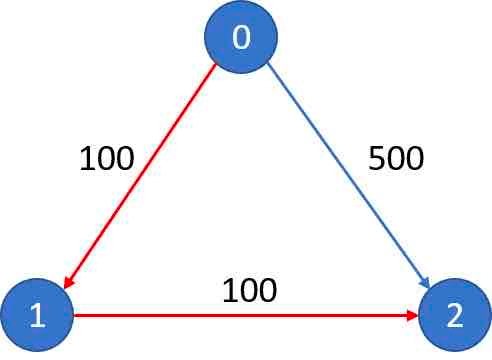
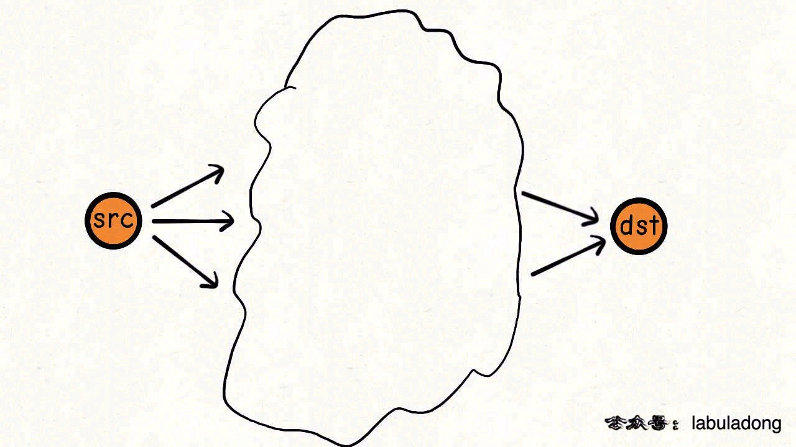
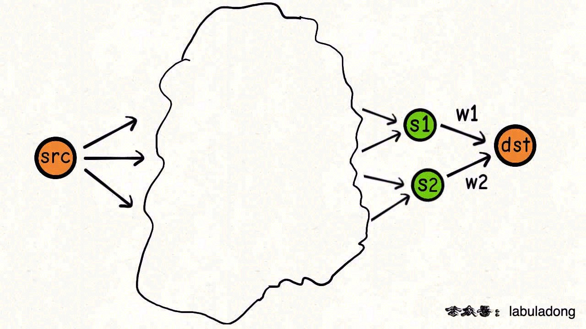
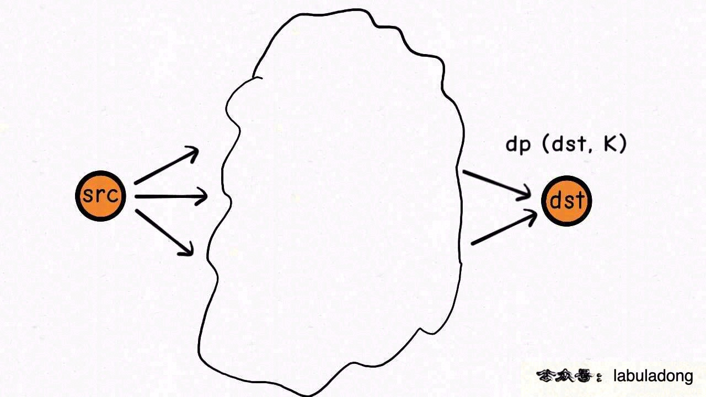
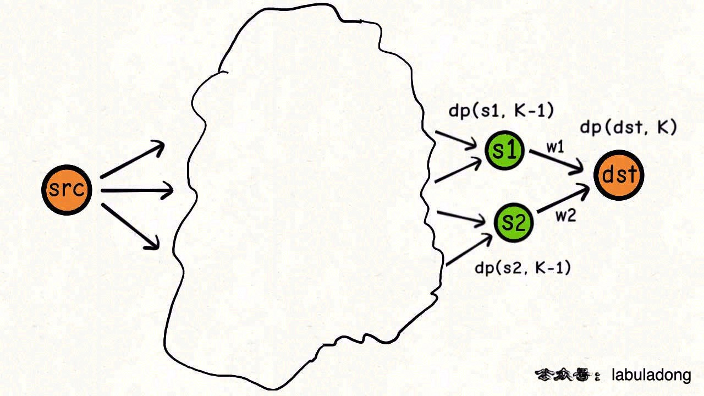

# 14 旅游省钱大法加权最短路径

| 牛客网 |                           LeetCode                           |                             力扣                             | 难度 |
| :----: | :----------------------------------------------------------: | :----------------------------------------------------------: | :--: |
|   -    | [787. Cheapest Flights Within K Stops](https://leetcode.com/problems/cheapest-flights-within-k-stops/) | [787. K 站中转内最便宜的航班](https://leetcode-cn.com/problems/cheapest-flights-within-k-stops/) |  🟠   |

**———–**

第 787 题「 [K 站中转内最便宜的航班](https://leetcode-cn.com/problems/cheapest-flights-within-k-stops/)」：

现在有 `n` 个城市，分别用 `0`, `1`…, `n - 1` 这些序号表示，城市之间的航线用三元组 `[from, to, price]` 来表示，比如说三元组 `[0,1,100]` 就表示，从城市 `0` 到城市 `1` 之间的机票价格是 100 元。

题目会给你输入若干参数：正整数 `n` 代表城市个数，数组 `flights` 装着若干三元组代表城市间的航线及价格，城市编号 `src` 代表你所在的城市，城市编号 `dst` 代表你要去的目标城市，整数 `K` 代表你最多经过的中转站个数。

函数签名如下：

```java
int findCheapestPrice(int n, int[][] flights, int src, int dst, int K);
```

请你的算法计算，在 `K` 次中转之内，从 `src` 到 `dst` 所需的最小花费是多少钱，如果无法到达，则返回 -1。

比方说题目给的例子：

```
n = 3, flights = [[0,1,100],[1,2,100],[0,2,500]], src = 0, dst = 2, K = 1
```

航线就是如下这张图所示，有向边代表航向的方向，边上的数字代表航线的机票价格：

[](https://labuladong.github.io/algo/images/旅行最短路径/7.png)

出发点是 `0`，到达点是 `2`，允许的最大中转次数 `K` 为 1，所以最小的开销就是图中红色的两条边，从 `0` 出发，经过中转城市 `1` 到达目标城市 `2`，所以算法的返回值应该是 200。

注意这个中转次数的上限 `K` 是比较棘手的，如果上述题目将 `K` 改为 0，也就是不允许中转，那么我们的算法只能返回 500 了，也就是直接从 `0` 飞到 `2`。

**很明显，这题就是个加权有向图中求最短路径的问题**。

说白了，就是给你一幅加权有向图，让你求 `src` 到 `dst` 权重最小的一条路径，同时要满足，**这条路径最多不能超过 `K + 1` 条边**（经过 `K` 个节点相当于经过 `K + 1` 条边）。

我们来分析下求最短路径相关的算法。

## 1. BFS 算法思路

我们前文 [BFS 算法框架详解](https://labuladong.github.io/algo/4/29/111/) 中说到，求最短路径，肯定可以用 BFS 算法来解决。

因为 BFS 算法相当于从起始点开始，一步一步向外扩散，那当然是离起点越近的节点越先被遍历到，如果 BFS 遍历的过程中遇到终点，那么走的肯定是最短路径。

不过呢，我们在 [BFS 算法框架详解](https://labuladong.github.io/algo/4/29/111/) 用的是普通的队列 `Queue` 来遍历多叉树，而对于加权图的最短路径来说，普通的队列不管用了，得用优先级队列 `PriorityQueue`。

为什么呢？也好理解，在多叉树（或者扩展到无权图）的遍历中，与其说边没有权重，不如说每条边的权重都是 1，起点与终点之间的路径权重就是它们之间「边」的条数。

这样，按照 BFS 算法一步步向四周扩散的逻辑，先遍历到的节点和起点之间的「边」更少，累计的权重当然少。

换言之，先进入 `Queue` 的节点就是离起点近的，路径权重小的节点。

但对于加权图，路径中边的条数和路径的权重并不是正相关的关系了，有的路径可能边的条数很少，但每条边的权重都很大，那显然这条路径权重也会很大，很难成为最短路径。

比如题目给的这个例子：

[](https://labuladong.github.io/algo/images/旅行最短路径/7.png)

你是可以一步从 `0` 走到 `2`，但路径权重不见得是最小的。

所以，对于加权图的场景，我们需要优先级队列「自动排序」的特性，将路径权重较小的节点排在队列前面，以此为基础施展 BFS 算法，也就变成了 [Dijkstra 算法](https://labuladong.github.io/algo/2/20/55/)。

代码如下：

```java
public int findCheapestPrice(int n, int[][] flights, int src, int dst, int K) {
    List<int[]>[] graph = new LinkedList[n];
    for (int i = 0; i < n; i++) {
        graph[i] = new LinkedList<>();
    }
    for (int[] edge : flights) {
        int from = edge[0];
        int to = edge[1];
        int price = edge[2];
        graph[from].add(new int[]{to, price});
    }

    // 启动 dijkstra 算法
    // 计算以 src 为起点在 k 次中转到达 dst 的最短路径
    K++;
    return dijkstra(graph, src, K, dst);
}

class State {
    // 图节点的 id
    int id;
    // 从 src 节点到当前节点的花费
    int costFromSrc;
    // 从 src 节点到当前节点经过的节点个数
    int nodeNumFromSrc;

    State(int id, int costFromSrc, int nodeNumFromSrc) {
        this.id = id;
        this.costFromSrc = costFromSrc;
        this.nodeNumFromSrc = nodeNumFromSrc;
    }
}

// 输入一个起点 src，计算从 src 到其他节点的最短距离
int dijkstra(List<int[]>[] graph, int src, int k, int dst) {
    // 定义：从起点 src 到达节点 i 的最短路径权重为 distTo[i]
    int[] distTo = new int[graph.length];
    // 定义：从起点 src 到达节点 i 至少要经过 nodeNumTo[i] 个节点
    int[] nodeNumTo = new int[graph.length];
    Arrays.fill(distTo, Integer.MAX_VALUE);
    Arrays.fill(nodeNumTo, Integer.MAX_VALUE);
    // base case
    distTo[src] = 0;
    nodeNumTo[src] = 0;

    // 优先级队列，costFromSrc 较小的排在前面
    Queue<State> pq = new PriorityQueue<>((a, b) -> {
        return a.costFromSrc - b.costFromSrc;
    });
    // 从起点 src 开始进行 BFS
    pq.offer(new State(src, 0, 0));

    while (!pq.isEmpty()) {
        State curState = pq.poll();
        int curNodeID = curState.id;
        int costFromSrc = curState.costFromSrc;
        int curNodeNumFromSrc = curState.nodeNumFromSrc;
        
        if (curNodeID == dst) {
            // 找到最短路径
            return costFromSrc;
        }
        if (curNodeNumFromSrc == k) {
            // 中转次数耗尽
            continue;
        }

        // 将 curNode 的相邻节点装入队列
        for (int[] neighbor : graph[curNodeID]) {
            int nextNodeID = neighbor[0];
            int costToNextNode = costFromSrc + neighbor[1];
            // 中转次数消耗 1
            int nextNodeNumFromSrc = curNodeNumFromSrc + 1;

            // 更新 dp table
            if (distTo[nextNodeID] > costToNextNode) {
                distTo[nextNodeID] = costToNextNode;
                nodeNumTo[nextNodeID] = nextNodeNumFromSrc;
            }
            // 剪枝，如果中转次数更多，花费还更大，那必然不会是最短路径
            if (costToNextNode > distTo[nextNodeID]
                && nextNodeNumFromSrc > nodeNumTo[nextNodeID]) {
                continue;
            }
            
            pq.offer(new State(nextNodeID, costToNextNode, nextNodeNumFromSrc));
        }
    }
    return -1;
}
```

关于这个解法这里就不多解释了，可对照前文 [Dijkstra 算法模板](https://labuladong.github.io/algo/2/20/55/) 理解。

最后扩展一下，有的读者可能会问：既然这个问题本质上是一个图的遍历问题，为什么不需要 `visited` 集合记录已经访问过的节点？

> 这个问题的答案在 [Dijkstra 算法模板](https://labuladong.github.io/algo/2/20/55/) 中探讨过，可以去看看。

## 2. 动态规划思路

我们前文 [动态规划核心套路详解](https://labuladong.github.io/algo/3/23/68/) 中说过，求最值的问题，很多都可能使用动态规划来求解。

加权最短路径问题，再加个 `K` 的限制也无妨，不也是个求最值的问题嘛，动态规划统统拿下。

我们先不管 `K` 的限制，但就「加权最短路径」这个问题来看看，它怎么就是个动态规划问题了呢？

比方说，现在我想计算 `src` 到 `dst` 的最短路径：

[](https://labuladong.github.io/algo/images/旅行最短路径/1.jpeg)

最小权重是多少？我不知道。

但我可以把问题进行分解：

[](https://labuladong.github.io/algo/images/旅行最短路径/2.jpeg)

`s1, s2` 是指向 `dst` 的相邻节点，它们之间的权重我是知道的，分别是 `w1, w2`。

只要我知道了从 `src` 到 `s1, s2` 的最短路径，我不就知道 `src` 到 `dst` 的最短路径了吗！

```python
minPath(src, dst) = min(
    minPath(src, s1) + w1, 
    minPath(src, s2) + w2
)
```

这其实就是递归关系了，就是这么简单。

**不过别忘了，题目对我们的最短路径还有个「路径上不能超过 `K + 1` 条边」的限制**。

那么我们不妨定义这样一个 `dp` 函数：

```java
int dp(int s, int k);
```

函数的定义如下：

**从起点 `src` 出发，`k` 步之内（一步就是一条边）到达节点 `s` 的最小路径权重为 `dp(s, k)`**。

那么，`dp` 函数的 base case 就显而易见了：

```java
// 定义：从 src 出发，k 步之内到达 s 的最小成本
    int dp(int s, int k) {
        // 从 src 到 src，一步都不用走
        if (s == src) {
            return 0;
        }
        // 如果步数用尽，就无解了
        if (k == 0) {
            return -1;
        }

        // ...
    }
```

题目想求的最小机票开销就可以用 `dp(dst, K+1)` 来表示：

```java
int findCheapestPrice(int n, int[][] flights, int src, int dst, int K) {
    // 将中转站个数转化成边的条数
    K++;
    //...
    return dp(dst, K);
```

添加了一个 `K` 条边的限制，状态转移方程怎么写呢？其实和刚才是一样的：

[](https://labuladong.github.io/algo/images/旅行最短路径/3.jpeg)

`K` 步之内从 `src` 到 `dst` 的最小路径权重是多少？我不知道。

但我可以把问题分解：

[](https://labuladong.github.io/algo/images/旅行最短路径/4.jpeg)

`s1, s2` 是指向 `dst` 的相邻节点，我只要知道 `K - 1` 步之内从 `src` 到达 `s1, s2`，那我就可以在 `K` 步之内从 `src` 到达 `dst`。

也就是如下关系式：

```java
dp(dst, k) = min(
    dp(s1, k - 1) + w1, 
    dp(s2, k - 1) + w2
)
```

这就是新的状态转移方程，如果你能看懂这个算式，就已经可以解决这道题了。

### 代码实现

根据上述思路，我怎么知道 `s1, s2` 是指向 `dst` 的相邻节点，他们之间的权重是 `w1, w2`？

我希望给一个节点，就能知道有谁指向这个节点，还知道它们之间的权重，对吧。

专业点说，得用一个数据结构记录每个节点的「入度」indegree：

```java
// 哈希表记录每个点的入度
// to -> [from, price]
HashMap<Integer, List<int[]>> indegree;
int src, dst;

public int findCheapestPrice(int n, int[][] flights, int src, int dst, int K) {
    // 将中转站个数转化成边的条数
    K++;
    this.src = src;
    this.dst = dst;
    
    indegree = new HashMap<>();
    for (int[] f : flights) {
        int from = f[0];
        int to = f[1];
        int price = f[2];
        // 记录谁指向该节点，以及之间的权重
      	// putIfAbsent() 方法会先判断指定的键（key）是否存在，不存在则将键/值对插入到 HashMap 中。
        indegree.putIfAbsent(to, new LinkedList<>());
        indegree.get(to).add(new int[] {from, price});
    }
    
    return dp(dst, K);
}
```

有了 `indegree` 存储入度，那么就可以具体实现 `dp` 函数了：

```java
// 定义：从 src 出发，k 步之内到达 s 的最短路径权重
int dp(int s, int k) {
    // base case
    if (s == src) {
        return 0;
    }
    if (k == 0) {
        return -1;
    }
    // 初始化为最大值，方便等会取最小值
    int res = Integer.MAX_VALUE;
    if (indegree.containsKey(s)) {
        // 当 s 有入度节点时，分解为子问题
        for (int[] v : indegree.get(s)) {
            int from = v[0];
            int price = v[1];
            // 从 src 到达相邻的入度节点所需的最短路径权重
            int subProblem = dp(from, k - 1);


            // 跳过无解的情况
            if (subProblem != -1) {
                res = Math.min(res, subProblem + price);
            }
        }
    }
    // 如果还是初始值，说明此节点不可达
    return res == Integer.MAX_VALUE ? -1 : res;
}
```

有之前的铺垫，这段解法逻辑应该是很清晰的。当然，对于动态规划问题，肯定要消除重叠子问题。

为什么有重叠子问题？很简单，如果某个节点同时指向两个其他节点，那么这两个节点就有相同的一个入度节点，就会产生重复的递归计算。

怎么消除重叠子问题？找问题的「状态」。

状态是什么？在问题分解（状态转移）的过程中变化的，就是状态。

**显然就是 `dp` 函数的参数 `s` 和 `k`，每次递归调用，目标点 `s` 和步数约束 `k` 在变化**。

所以，本题的状态有两个，应该算是二维动态规划，我们可以用一个 `memo` 二维数组或者哈希表作为备忘录，减少重复计算。

我们选用二维数组做备忘录吧，注意 `K` 是从 1 开始算的，所以备忘录初始大小要再加一：

```java
int src, dst;
HashMap<Integer, List<int[]>> indegree;
// 备忘录
int[][] memo;

public int findCheapestPrice(int n, int[][] flights, int src, int dst, int K) {
    K++;
    this.src = src;
    this.dst = dst;
    // 初始化备忘录，全部填一个特殊值
    memo = new int[n][K + 1];
    for (int[] row : memo) {
        Arrays.fill(row, -888);
    }
    
    // 其他不变
    // ...
    
    return dp(dst, K);
}

// 定义：从 src 出发，k 步之内到达 s 的最小成本
int dp(int s, int k) {
    // base case
    if (s == src) {
        return 0;
    }
    if (k == 0) {
        return -1;
    }
    // 查备忘录，防止冗余计算
    if (memo[s][k] != -888) {
        return memo[s][k];
    }
    
    // 状态转移不变
    // ...
    
    // 存入备忘录
    memo[s][k] = res == Integer.MAX_VALUE ? -1 : res;
    return memo[s][k];
}
```

备忘录初始值为啥初始为 -888？前文 [base case 和备忘录的初始值怎么定](https://labuladong.github.io/algo/3/23/71/) 说过，随便初始化一个无意义的值就行。

至此，这道题就通过自顶向下的递归方式解决了。

其实，大家如果把我们号之前的所有动态规划文章都看一遍，就会发现我们一直在套用 [动态规划核心套路](https://labuladong.github.io/algo/3/23/68/)，其实真没什么困难的。