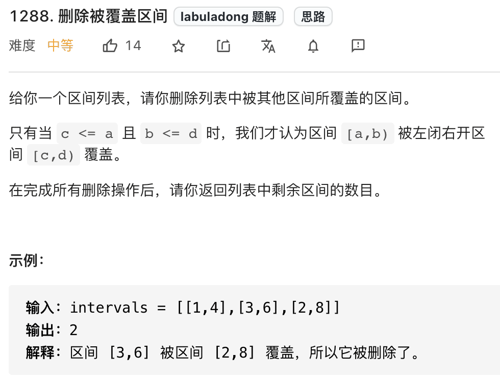
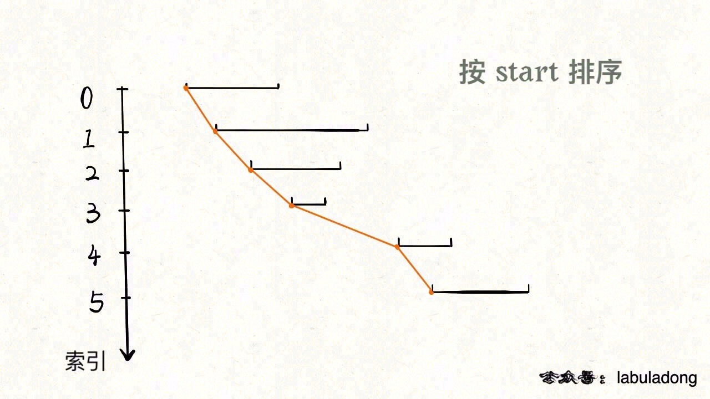
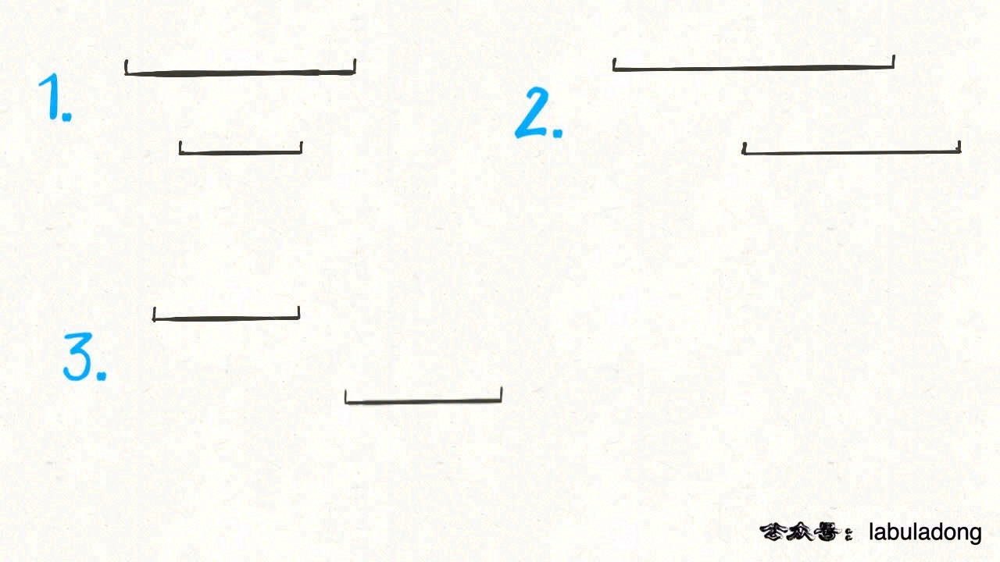
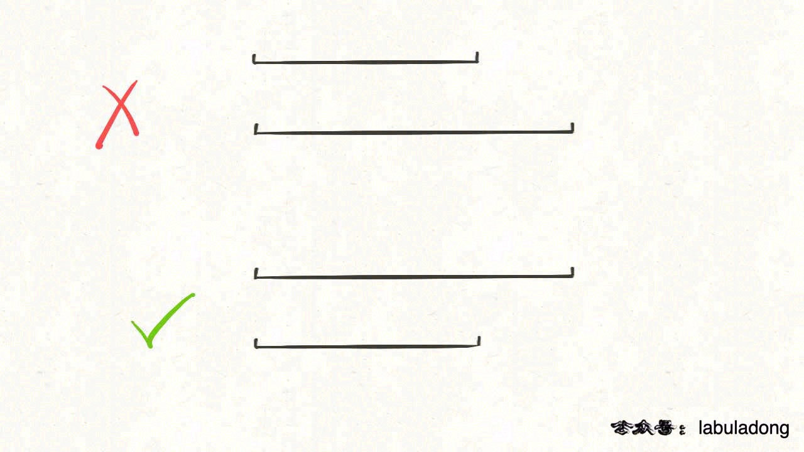
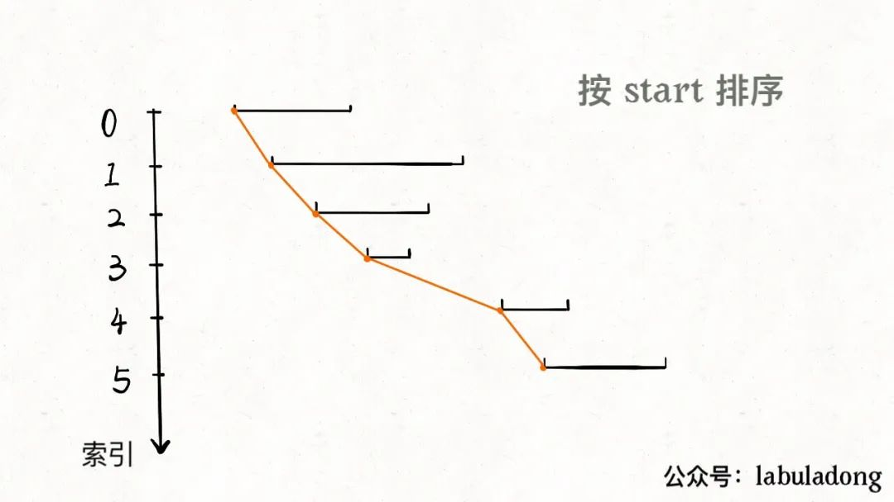
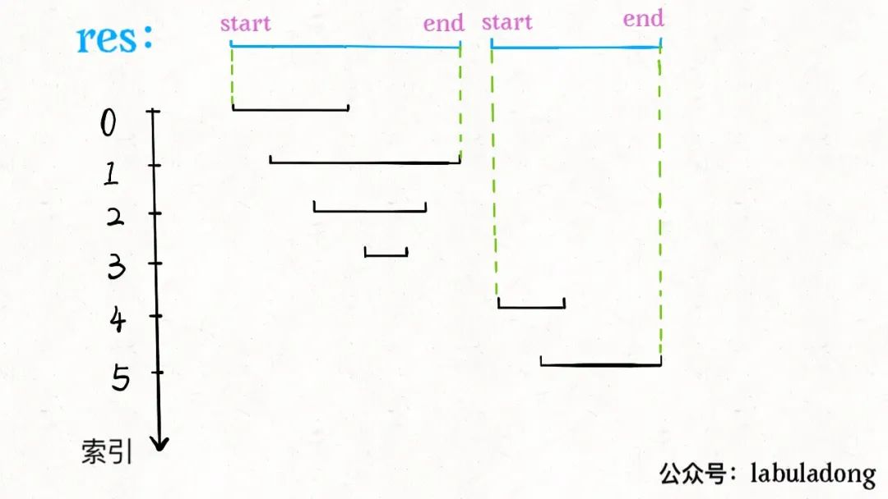

# 贪心算法解决三道区间问题

|                             力扣                             | 难度 |
| :----------------------------------------------------------: | :--: |
| [1288. 删除被覆盖区间](https://leetcode-cn.com/problems/remove-covered-intervals/) |  🟠   |
| [56. 合并区间](https://leetcode-cn.com/problems/merge-intervals/) |  🟠   |
| [986. 区间列表的交集](https://leetcode-cn.com/problems/interval-list-intersections/) |  🟠   |

经常有读者问区间相关的问题，今天写一篇文章，秒杀三道区间相关的问题。

所谓区间问题，就是线段问题，让你合并所有线段、找出线段的交集等等。主要有两个技巧：

**1、排序**。常见的排序方法就是按照区间起点排序，或者先按照起点升序排序，若起点相同，则按照终点降序排序。当然，如果你非要按照终点排序，无非对称操作，本质都是一样的。

**2、画图**。就是说不要偷懒，勤动手，两个区间的相对位置到底有几种可能，不同的相对位置我们的代码应该怎么去处理。

废话不多说，下面我们来做题。

## 1. 区间覆盖问题

这是力扣第 1288 题「 [删除被覆盖区间](https://leetcode-cn.com/problems/remove-covered-intervals/)」，看下题目：

[](https://labuladong.github.io/algo/images/区间合集/title.png)

题目问我们，去除被覆盖区间之后，还剩下多少区间，**那么我们可以先算一算，被覆盖区间有多少个，然后和总数相减就是剩余区间数**。

对于这种区间问题，如果没啥头绪，首先排个序看看，比如我们按照区间的起点进行升序排序：

[](https://labuladong.github.io/algo/images/mergeInterval/1.jpg)

排序之后，两个相邻区间可能有如下三种相对位置：

[](https://labuladong.github.io/algo/images/区间合集/1.jpeg)

对于这三种情况，我们应该这样处理：

对于情况一，找到了覆盖区间。

对于情况二，两个区间可以合并，成一个大区间。

对于情况三，两个区间完全不相交。

依据几种情况，我们可以写出如下代码：

```java
int removeCoveredIntervals(int[][] intvs) {
    // 按照起点升序排列，起点相同时降序排列
    Arrays.sort(intvs, (a, b)->{
            // 升序
            if(a[0] > b[0]) return 1;
            if(a[0] < b[0]) return -1;
            // 降序
            if(a[0]==b[0]){
                if(a[1] > b[1]) return -1;
                if(a[1] < b[1]) return 1;
            }
            return 0;
        });
    // 记录合并区间的起点和终点
    int left = intvs[0][0];
    int right = intvs[0][1];
    
    int res = 0;
    for (int i = 1; i < intvs.length; i++) {
        int[] intv = intvs[i];
        // 情况一，找到覆盖区间
        if (left <= intv[0] && right >= intv[1]) {
            res++;
        }
        // 情况二，找到相交区间，合并
        if (right >= intv[0] && right <= intv[1]) {
            right = intv[1];
        }
        // 情况三，完全不相交，更新起点和终点
        if (right < intv[0]) {
            left = intv[0];
            right = intv[1];
        }
    }
    
    return intvs.length - res;
}
```

以上就是本题的解法代码，起点升序排列，终点降序排列的目的是防止如下情况：

[](https://labuladong.github.io/algo/images/区间合集/2.jpeg)

对于这两个起点相同的区间，我们需要保证长的那个区间在上面（按照终点降序），这样才会被判定为覆盖，否则会被错误地判定为相交，少算一个覆盖区间。

## 2. 区间合并问题

[56. 合并区间 - 力扣](https://leetcode-cn.com/problems/merge-intervals/)


我们解决区间问题的一般思路是先排序，然后观察规律。

一个区间可以表示为`[start, end]`，前文聊的区间调度问题，需要按`end`排序，以便满足贪心选择性质。而对于区间合并问题，其实按`end`和`start`排序都可以，不过为了清晰起见，我们选择按`start`排序。



**显然，对于几个相交区间合并后的结果区间`x`，`x.start`一定是这些相交区间中`start`最小的，`x.end`一定是这些相交区间中`end`最大的。**



由于已经排了序，`x.start`很好确定，求`x.end`也很容易，可以类比在数组中找最大值的过程：

```java
int max_ele = arr[0];
for (int i = 1; i < arr.length; i++) 
    max_ele = max(max_ele, arr[i]);
return max_ele;
```

然后就可以写出完整代码

```java
class Solution {
    public int[][] merge(int[][] intervals) {
        int n = intervals.length;
        if(n==1) return intervals;

        Arrays.sort(intervals, (o1, o2)->{
            // 前大后小 renturn 1  就是升序
            if(o1[0]>o2[0]) return 1;
            if(o1[0]<o2[0]) return -1;
            return 0;
        });

        int left = intervals[0][0];
        int right = intervals[0][1];
        List<int[]> ans = new ArrayList<>();

        for(int i=1; i<n; ++i){
            int curLeft = intervals[i][0];
            int curRight = intervals[i][1];
            if(curLeft>right){
                ans.add(new int[]{left, right});
                left = curLeft;
                right = curRight;
            }else{
                right = Math.max(right, curRight);
            }
        }
        //加入最后一个
        ans.add(new int[]{left, right});
        return ans.toArray(new int[ans.size()][]);
    }
}
```

## 3. 区间交集

[986. 区间列表的交集 - 力扣](https://leetcode-cn.com/problems/interval-list-intersections/)


题目很好理解，就是让你找交集，注意区间都是闭区间。

解决区间问题的思路一般是先排序，以便操作，不过题目说已经排好序了，那么可以用两个索引指针在`A`和`B`中游走，把交集找出来。

首先，**对于两个区间**，我们用`[a1,a2]`和`[b1,b2]`表示在`A`和`B`中的两个区间，那么什么情况下这两个区间**没有交集**呢：


只有这两种情况，写成代码的条件判断就是这样：

```python
if b2 < a1 or a2 < b1:
    [a1,a2] 和 [b1,b2] 无交集
```

那么，什么情况下，两个区间存在交集呢？根据命题的否定，上面逻辑的否命题就是存在交集的条件：

```python
# 不等号取反，or 也要变成 and
if b2 >= a1 and a2 >= b1:
    [a1,a2] 和 [b1,b2] 存在交集
```

接下来，两个区间存在交集的情况有哪些呢？穷举出来：


我们惊奇地发现，交集区间是有规律的！如果交集区间是`[c1,c2]`，那么`c1=max(a1,b1)`，`c2=min(a2,b2)`！这一点就是寻找交集的核心，我们把代码更进一步：


```java
class Solution {
    public int[][] intervalIntersection(int[][] firstList, int[][] secondList) {
        int n = firstList.length, m = secondList.length;
        if(n==0||m==0) return new int[][]{};

        List<int[]> ans = new ArrayList<>();
        int i = 0, j = 0;
        while(i<n && j<m){
            int l1 = firstList[i][0];
            int r1 = firstList[i][1];

            int l2 = secondList[j][0];
            int r2 = secondList[j][1];
            int l = Math.max(l1, l2);
            int r = Math.min(r1, r2);
            if(l<=r){           
                ans.add(new int[]{l,r});
            }
            if(r1 > r2){
                ++j;
            }else{
                ++i;
            }
        }
        return ans.toArray(new int[ans.size()][]);      
    }
}
```

